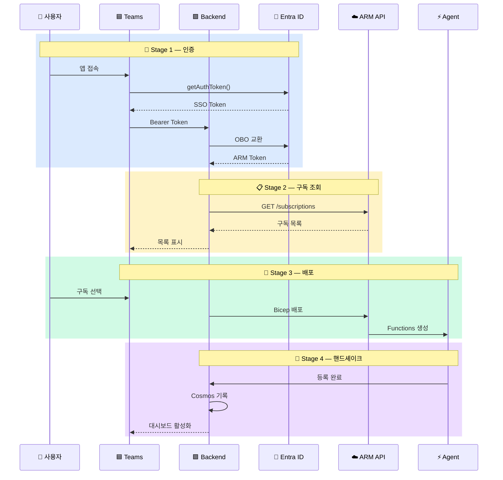
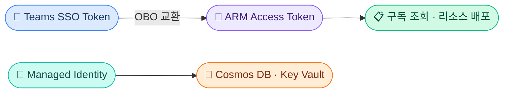
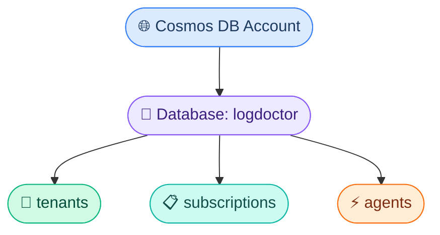

# Azure 서비스 통합 요약 (Log Doctor)

---

## 📐 전체 아키텍처 흐름

---

## 🔐 인증 & 보안 (3개 서비스)

### Entra ID (구 Azure AD)
- **역할**: 전체 플랫폼의 신원 인증 허브
- **핵심 흐름**: SSO → OBO(On-Behalf-Of) → ARM 접근
- **토큰 종류**: Access Token, Refresh Token, ID Token
- **JWT 구조**: Header(alg, typ) + Payload(sub, tid, aud, roles) + Signature
- **Teams 연동**: `teams-js` SDK의 `getAuthToken()`으로 Silent SSO
- **Admin Consent**: SaaS 멀티테넌트 앱에서 테넌트 관리자 일괄 동의

### Managed Identity
- **원칙**: 시크릿 없는 서비스 간 인증 (자동 회전)
- **지원 서비스**: Container Apps, App Service, Functions, Cosmos DB, Storage, Key Vault
- **코드**: `DefaultAzureCredential()` → MI 우선, 로컬은 az login 폴백

### RBAC (역할 기반 접근 제어)
- **구조**: Principal(누가) + Role(무엇을) + Scope(어디서)
- **스코프 계층**: Management Group → Subscription → Resource Group → Resource (상속)
- **주요 역할**: Owner, Contributor, Reader, AcrPull, Key Vault Secrets User 등
- **Bicep 패턴**: `guid()` 함수로 멱등성 보장

---

## 🖥️ 컴퓨팅 (3개 서비스)

### Azure Functions (에이전트 실행)
- **용도**: Client Agent의 6개 엔진 실행 환경
- **트리거**: HTTP, Timer, Queue, Blob, Cosmos DB, Event Grid 등
- **Durable Functions**: 체이닝, Fan-out/Fan-in, 모니터, 비동기 HTTP API
- **호스팅**: Consumption(종량), Premium(VNET), Dedicated, Container Apps
- **배포**: Bicep + Managed Identity + Application Insights 통합

### Container Apps (백엔드 호스팅)
- **용도**: Provider Backend(FastAPI) 호스팅
- **핵심**: 리비전 시스템 (불변 스냅샷, 트래픽 분할로 카나리/블루그린)
- **스케일링**: KEDA 기반 자동 스케일링 (HTTP, Queue, Custom 메트릭)
- **시크릿**: Key Vault 참조로 환경변수 주입
- **리소스**: 0.25~2 vCPU, 메모리 비례 할당

### ACR (Azure Container Registry)
- **용도**: Backend 컨테이너 이미지 저장소
- **SKU**: Basic($5) / Standard($20) / Premium($50)
- **인증**: Managed Identity + AcrPull 역할
- **빌드**: ACR Tasks로 클라우드 빌드, Git 트리거 자동 빌드

---

## 💾 데이터 (2개 서비스)

### Cosmos DB (메타데이터 저장)
- **용도**: 테넌트, 구독, 에이전트 정보 저장
- **파티션 키**: `/tenant_id` (성능과 비용의 핵심)
- **RU**: 읽기 1KB=1RU, 쓰기≈5RU, 쿼리는 복잡도에 비례
- **가격 모델**: Provisioned / Autoscale / Serverless(개발용 추천)
- **일관성**: Session(기본값) — 대부분의 SaaS에 적합

> 모든 컨테이너의 Partition Key: `/tenant_id`

### Log Analytics Workspace (로그 분석)
- **용도**: 고객 Azure 리소스 로그의 중앙 저장/분석
- **테이블**: AzureActivity, AzureDiagnostics, AppTraces, AppExceptions 등
- **보존**: 30~730일 (기간에 비례한 비용)
- **KQL**: 파이프라인 기반 쿼리 언어 (`where` → `project` → `summarize`)
- **비용 최적화**: DCR로 수집 필터링, Archive 티어, 보존 기간 조정

---

## 🔧 인프라 & 배포 (3개 서비스)

### Bicep (IaC)
- **용도**: 전체 Azure 인프라 선언적 정의
- **문법**: resource, param, var, output, module, existing
- **함수**: `resourceGroup()`, `uniqueString()`, `guid()` 등
- **스코프**: resourceGroup, subscription, managementGroup, tenant
- **패턴**: 환경 분기, 태그 표준화, 의존성 관리

### ARM API (리소스 관리)
- **용도**: 구독 조회, 리소스 배포의 REST 인터페이스
- **핵심 API**: `GET /subscriptions`, 배포 API(Incremental/Complete 모드)
- **Portal Handoff**: 커스텀 URL로 Azure Portal 배포 페이지 직접 연결
- **인증**: Bearer Token, Client Credentials, Managed Identity

### Key Vault (시크릿 관리)
- **관리 대상**: Secrets, Keys, Certificates
- **보호**: Soft Delete + Purge Protection 기본 활성화
- **접근**: RBAC 방식 권장 (Access Policy는 레거시)
- **연동**: Container App 환경변수, App Service 참조 구문

---

## 📊 모니터링 (2개 서비스)

### Diagnostic Settings (로그 라우팅)
- **역할**: Azure 리소스 로그를 LAW/Storage/Event Hub로 전송
- **설정 대상**: Key Vault, Container Apps, App Service, Functions, Storage, SQL 등
- **DCR**: 차세대 데이터 수집 — KQL 변환으로 수집 시 필터링 가능
- **Bicep**: `scope` 속성으로 대상 리소스 지정

### Application Insights (앱 모니터링)
- **역할**: 애플리케이션 수준 텔레메트리 수집 (SDK 기반)
- **데이터**: Traces, Exceptions, Requests, Dependencies → LAW로 자동 전송
- **Log Doctor 관계**: AI가 수집 → LAW에 저장 → Log Doctor가 LAW 읽기

---

## ⚡ Teams App (프론트엔드)

### Teams Tab App
- **유형**: Personal Tab (React SPA)
- **SDK**: `@microsoft/teams-js`로 SSO, 테마, 딥링크 처리
- **Manifest**: `staticTabs` + `webApplicationInfo`(SSO) 필수
- **UI 흐름**: 로그인 → 구독 선택 → 배포 → 대시보드
- **배포**: 사이드로딩(테스트) → Partner Center(프로덕션)

---

## 🌐 환경 변수 요약

| 구분 | 변수 | 설명 |
|------|------|------|
| **Backend** | `AUTH_METHOD` | `managed_identity` 또는 `secret` |
| | `CLIENT_ID` / `TENANT_ID` | Entra ID 앱 등록 정보 |
| | `CLIENT_SECRET` | secret 모드 전용 |
| | `APP_ID_URI` | 토큰 Audience 검증 |
| | `COSMOS_ENDPOINT` / `KEY` / `DATABASE` | Cosmos DB 연결 |
| **Frontend** | `TEAMS_APP_TENANT_ID` / `TEAMS_APP_ID` | Teams 앱 식별 |
| | `TAB_ENDPOINT` | 배포된 탭 URL |
| | `AZURE_SUBSCRIPTION_ID` | 배포 대상 구독 |

> **팁**: 로컬 개발 시 `AUTH_METHOD=managed_identity` + `az login`으로 시크릿 없이 인증 가능
