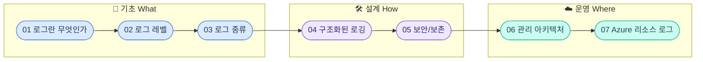

# 로깅 이론 통합 요약서

---

## 전체 구조



---

## 1. 로그란 무엇인가

### 정의

시스템에서 발생하는 **사건(Event)의 시간순 기록**. 장애 대응, 보안 추적, 성능 분석의 근간.

### 6W 원칙 — 좋은 로그의 필수 요소

| 요소 | 질문 | 예시 |
|------|------|------|
| **When** | 언제? | `2026-02-25T14:30:00.123+09:00` |
| **Where** | 어디서? | `payment-service`, `/api/v1/orders` |
| **Who** | 누가? | `user-id: U-456`, `IP: 10.0.1.5` |
| **What** | 무엇이? | `Order created`, `Login failed` |
| **How** | 어떻게? | `HTTP 500`, `timeout after 30s` |
| **Why** | 왜? | `DB connection pool exhausted` |

### Observability 3대 축


> Logs: 무엇이 일어났는가 / Metrics: 얼마나 발생하는가 / Traces: 어디를 거쳐갔는가

### Syslog 역사

| 세대 | 표준 | 특징 |
|------|------|------|
| 1세대 | RFC 3164 (2001) | 비공식 표준, 자유 형식 |
| 2세대 | RFC 5424 (2009) | 구조화된 데이터, 정밀 타임스탬프 |
| 현재 | OpenTelemetry | 로그+메트릭+트레이스 통합 |

---

## 2. 로그 레벨

6단계 심각도 체계. **상위 레벨을 설정하면 하위 레벨은 자동 포함**.

### 레벨 정의

| 레벨 | 의미 | 프로덕션 출력 | 예시 |
|------|------|:---:|------|
| **FATAL** | 시스템 중단 | O | DB 연결 불가, OOM |
| **ERROR** | 기능 실패 | O | API 500 응답, 결제 실패 |
| **WARN** | 잠재 문제 | O | 재시도 발생, 디스크 80% |
| **INFO** | 정상 동작 | O | 서버 시작, 요청 처리 완료 |
| **DEBUG** | 개발 상세 | X | 변수값, SQL 쿼리 |
| **TRACE** | 최하위 상세 | X | 함수 진입/퇴장 |

### 레벨 선택 의사결정


### 환경별 권장 설정

| 환경 | 최소 레벨 | 이유 |
|------|-----------|------|
| **Production** | INFO | 비용 절감, 노이즈 방지 |
| **Staging** | DEBUG | 배포 전 검증 |
| **Development** | TRACE | 최대 상세 |

### 흔한 안티패턴

- ERROR로 기록해야 할 것을 INFO로 기록
- 민감 정보(비밀번호, 토큰)를 로그에 포함
- 프로덕션에서 DEBUG 레벨을 켜둔 채 방치 (비용 폭발)
- 같은 에러를 여러 레이어에서 중복 로깅

---

## 3. 애플리케이션 로그 종류

3차원으로 분류: **운영 / 보안 / 비즈니스**.

### 운영 로그 (Operational)

| 유형 | 포맷 | 핵심 필드 |
|------|------|-----------|
| **Access Log** | Apache CLF → JSON | IP, Method, Path, Status, Duration |
| **Error Log** | 스택 트레이스 | Exception Type, Message, Stack |
| **Performance Log** | 메트릭 기반 | Latency, CPU, Memory, Queue Depth |

### 보안 로그 (Security)

| 유형 | 기반 | 필수 기록 |
|------|------|-----------|
| **인증 로그** | MITRE Kill Chain | 로그인 시도, 실패, MFA 결과 |
| **인가 로그** | RBAC/ABAC | 권한 검증 결과, 차단된 접근 |
| **감사 로그** | NIST 800-53 AU | 누가, 언제, 무엇을, 어디서 변경했는가 |

### 비즈니스 로그 (Business)

| 유형 | 목적 | GDPR 주의 |
|------|------|-----------|
| **트랜잭션** | 주문/결제 이력 추적 | 개인 식별 정보 최소화 |
| **행동** | 사용자 행동 분석 | 동의 기반 수집 필수 |
| **변경** | 데이터 변경 이력 | 보존 기간 명시 |

---

## 4. 구조화된 로깅 (Structured Logging)

### 핵심: 텍스트 → JSON 전환

```
# 비구조화 (파싱 어려움)
2026-02-25 14:30:00 ERROR PaymentService - Payment failed for user U-456

# 구조화 (기계 파싱 가능)
{"timestamp":"2026-02-25T14:30:00Z","level":"ERROR","service":"payment",
 "message":"Payment failed","user_id":"U-456","trace_id":"abc-123"}
```

### 4대 원칙

| 원칙 | 설명 |
|------|------|
| **일관성** | 모든 서비스가 동일 필드명 사용 |
| **풍부한 컨텍스트** | trace_id, user_id, service 등 포함 |
| **민감정보 배제** | 비밀번호, 토큰, 카드번호 절대 불포함 |
| **이벤트 지향** | "무슨 일이 일어났는가" 중심 |

### 표준 필드 설계

| 분류 | 필드 | 필수 여부 |
|------|------|:---------:|
| **필수** | timestamp, level, service, message | O |
| **트레이싱** | trace_id, span_id, parent_id | 분산 시스템 |
| **주체** | user_id, session_id, client_ip | 상황별 |
| **이벤트** | event_type, action, resource | 감사용 |

### MDC (Mapped Diagnostic Context)

요청 시작 시 컨텍스트를 설정하면, 해당 요청의 모든 로그에 자동 포함:

```python
# Python structlog 예시
import structlog
logger = structlog.get_logger()
logger = logger.bind(trace_id="abc-123", user_id="U-456")
logger.info("Payment started")   # trace_id, user_id 자동 포함
logger.error("Payment failed")   # 여기에도 자동 포함
```

### ECS vs OpenTelemetry

| 항목 | ECS (Elastic) | OTel Semantic Conventions |
|------|---------------|--------------------------|
| 주 용도 | ELK 스택 | 벤더 중립 |
| 필드 예시 | `event.action` | `event.name` |
| 추세 | ELK 생태계 표준 | 업계 표준으로 수렴 중 |

---

## 5. 보안 로그 보존

### 왜 보존이 중요한가

- 보안 사고 평균 탐지 소요: **204일** (IBM 보고서)
- 204일 전 로그가 없으면 공격 원인 분석 불가

### 규제별 보존 기간

| 규제 | 최소 보존 | 대상 |
|------|-----------|------|
| 개인정보보호법 (PIPA) | 1~2년 | 접속 기록 |
| 전자금융감독규정 | 5년 | 거래 기록 |
| ISMS-P | 1년 | 보안 로그 |

### NIST SP 800-92 로그 생명주기


### 계층형 저장소 전략

| 계층 | 기간 | 비용 | 쿼리 |
|------|------|------|------|
| **HOT** (LAW) | 0~14일 | 높음 ($2.76/GB) | 즉시 |
| **WARM** (Blob Cool) | 14일~6개월 | 중간 ($0.01/GB) | 수분 |
| **COLD** (Blob Archive) | 6개월~수년 | 매우 낮음 ($0.002/GB) | 수시간 |

> HOT → COLD 전환 시 약 **81% 비용 절감** 가능

### 5대 로그 보호 계층

1. **수집 보장**: 로그 누락 방지 (버퍼, 재전송)
2. **무결성**: 해시 체인으로 변조 감지
3. **접근 제어**: RBAC 기반 로그 열람 제한
4. **WORM 저장**: Write Once Read Many (삭제/수정 불가)
5. **시간 동기화**: NTP로 모든 시스템 시간 통일

---

## 6. 로그 관리 아키텍처

### 5단계 파이프라인


### 수집 에이전트 비교

| 에이전트 | 메모리 | 언어 | 장점 |
|----------|--------|------|------|
| **Fluent Bit** | ~1MB | C | 초경량, 컨테이너 최적 |
| **Filebeat** | ~30MB | Go | Elastic 생태계 통합 |
| **Vector** | ~15MB | Rust | 고성능, 유연한 파이프라인 |
| **Logstash** | ~200MB | JRuby | 풍부한 플러그인, 무거움 |

### 스택 비교

| 스택 | 구성 | 비용 | 적합 |
|------|------|------|------|
| **ELK** | Elasticsearch + Logstash + Kibana | 높음 | 대규모, 풍부한 분석 |
| **EFK** | Elasticsearch + Fluent Bit + Kibana | 중간 | K8s 환경 |
| **PLG** | Promtail + Loki + Grafana | 낮음 | 비용 민감, 메트릭 통합 |

### 팀 규모별 권장 아키텍처

| 규모 | 아키텍처 | 특징 |
|------|----------|------|
| **소규모** (1~5명) | Fluent Bit → Loki → Grafana | 저비용, 간단 운영 |
| **중규모** (5~20명) | Fluent Bit → Elasticsearch → Kibana | 검색 강점 |
| **대규모** (20명+) | Kafka → Flink → ES + SIEM | 실시간 처리, 보안 분석 |

### SIEM 기본 개념

**Security Information and Event Management** — 여러 소스의 로그를 **상관 분석(Correlation)**하여 보안 위협을 탐지.

```
단일 이벤트: "로그인 실패" → 정상 (사람이 비밀번호 틀림)
상관 분석:   "같은 IP에서 3분간 50회 로그인 실패" → 공격 (브루트포스)
```

---

## 7. Azure 리소스 로그

### Azure 로그 3계층


### 계층별 주요 로그

| 계층 | 테이블 | 내용 |
|------|--------|------|
| **Tenant** | SigninLogs | 사용자 로그인 기록 |
| | AuditLogs | 디렉토리 변경 (권한, 그룹) |
| **Subscription** | AzureActivity | 리소스 CRUD 이력 |
| **Resource** | AppTraces | 애플리케이션 로그 |
| | AppExceptions | 예외/에러 스택 |
| | AppRequests | HTTP 요청/응답 |
| | AppDependencies | 외부 호출 (DB, API) |
| | ContainerAppConsoleLogs | 컨테이너 stdout/stderr |

### Diagnostic Settings 구성


### KQL 핵심 연산자

| 연산자 | 용도 | 예시 |
|--------|------|------|
| `where` | 필터 | `where SeverityLevel >= 3` |
| `summarize` | 집계 | `summarize count() by Level` |
| `project` | 열 선택 | `project TimeGenerated, Message` |
| `join` | 테이블 조인 | `join kind=inner (Table2) on Key` |
| `render` | 시각화 | `render timechart` |
| `ago()` | 시간 범위 | `where TimeGenerated > ago(1h)` |

### 비용 관리 전략

1. **Basic 로그 계층**: 저빈도 접근 테이블에 적용 (80% 저렴)
2. **보존 기간 설정**: 테이블별 차등 보존 (30일~2년)
3. **DCR 필터링**: 수집 시점에 불필요한 로그 차단
4. **일일 용량 제한**: 의도치 않은 비용 폭발 방지
5. **커밋먼트 티어**: 일 100GB 이상 시 최대 30% 할인
