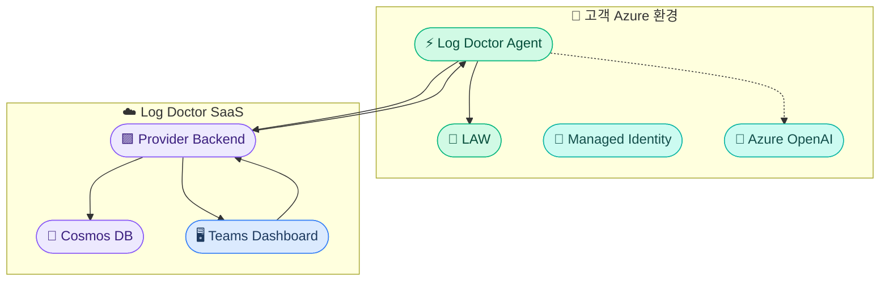

# Log Doctor 서비스 개요 요약서

---

## 한 줄 요약

고객사의 Azure LAW를 자동 진찰하여 **로그 비용 절감 + 보안 위협 탐지**를 제공하는 멀티테넌트 SaaS.

---

## 해결하는 문제

| 문제 | 현실 |
|------|------|
| **비용** | 매달 LAW 비용이 왜 이렇게 나오는가 |
| **노이즈** | 로그가 너무 많아 중요한 게 뭔지 모름 |
| **컴플라이언스** | 보안 로그 1년 보존 어떻게 하나 |
| **로그 품질** | Debug 로그가 프로덕션에서 쏟아짐 |
| **탐지 지연** | 공격을 뒤늦게 인지 |

> 핵심: 대부분 기업이 로그를 **"수집은 하지만 관리는 안 하고"** 있음

---

## 아키텍처



> 고객 데이터는 고객 환경 밖으로 나가지 않음 (Data Sovereignty)

---

## 5가지 핵심 기능

| # | 기능 | 하는 일 | 비유 |
|:-:|------|---------|------|
| 🔵 | **진찰** | 수집 → 정규화 → 분류 → 리포트 | 건강검진 |
| 1 | **Retain** | 중요도별 보존 기간 + Blob Archive | 약 유효기간 관리 |
| 2 | **Prevent** | Debug-in-prod, 과다 로깅 감지 → 권고 | 생활습관 개선 |
| 3 | **Detect** | 보안 위협 패턴 → 인시던트 생성 | MRI 정밀검사 |
| 4 | **Filter** | 노이즈 수집 차단 (DCR 제어) | 건강한 식단 필터 |
| 🤖 | **LLM** | 4개 엔진 규칙 자동 제안 (Human-in-the-loop) | AI 보조 진단 |

---

## 보안 설계

| 항목 | 방식 |
|------|------|
| 인증 | Managed Identity (Zero Secret) |
| 데이터 주권 | Agent가 고객 환경 내부에서만 원본 접근 |
| 통신 | Provider ↔ Agent: OBO 토큰 교환 |
| LLM | Azure OpenAI를 고객 구독에 배포 |
| 변경 안전 | 모든 변경 전 스냅샷, Teams에서 원클릭 원복 |

---

## 비용 절감 효과 (예시)

```
고객사 A: 일 10GB 로그 발생

  Before: 모든 로그 LAW 30일 보존 → 월 ~$828

  After Log Doctor:
  ├ 진찰: Debug 70%, 노이즈 30% 식별
  ├ Filter: 노이즈 30% 수집 차단         → -30%
  ├ Retain: Debug 7일 + 나머지 Archive   → -45%
  ├ Prevent: Debug-in-prod 알림 → 수정   → -15%
  └ 월 비용: ~$200/월 (약 75% 절감)
```

---

## 배포 모델

```mermaid
flowchart LR
    A(["🔐 SSO 로그인"]):::blue
    B(["🚀 원클릭 배포"]):::purple
    C(["🤝 자동 Handshake"]):::teal
    D(["🔬 자동 진찰"]):::green
    E(["📊 대시보드"]):::orange
    F(["⚙️ 엔진 실행"]):::red

    A --> B --> C --> D --> E --> F

    classDef blue fill:#dbeafe,stroke:#3b82f6,color:#1e3a5f
    classDef purple fill:#ede9fe,stroke:#8b5cf6,color:#3b1f7e
    classDef teal fill:#ccfbf1,stroke:#14b8a6,color:#134e4a
    classDef green fill:#d1fae5,stroke:#10b981,color:#064e3b
    classDef orange fill:#ffedd5,stroke:#f97316,color:#7c2d12
    classDef red fill:#fee2e2,stroke:#ef4444,color:#7f1d1d
```



> 고객이 할 일: **로그인 + 구독 선택 + 배포 버튼 클릭**. 나머지는 전부 자동.

---

## 기술 스택

| 구성 요소 | 기술 | 이유 |
|-----------|------|------|
| Backend | FastAPI (Python) | 비동기, Azure SDK 호환 |
| Agent | Azure Functions (Python) | 서버리스, MI 네이티브 |
| Frontend | Teams App (React) | 고객 환경 자연 통합 |
| DB | Cosmos DB | 멀티테넌트 파티셔닝 |
| 인증 | Entra ID + OBO | 멀티테넌트 SSO |
| 배포 | Bicep | 원클릭 배포 |
| LLM | Azure OpenAI (GPT-4o-mini) | 고객 환경, 저비용 |

---

## 코드 저장소

| 저장소 | 역할 |
|--------|------|
| `log-doctor-provider-back` | Provider Backend API |
| `log-doctor-provider-front` | Teams Dashboard |
| `log-doctor-client-back` | Client Agent |
| `log-doctor-document` | 프로젝트 문서 |

---

## 현재 진행 상황

| 구간 | 상태 |
|------|:----:|
| Provider Backend 기본 구조 | ✅ |
| Teams App 기본 구조 | ✅ |
| Client Agent 기본 구조 | ✅ |
| 로그 표준화 설계 | ✅ |
| 진찰 모듈 구현 | 🔲 다음 |
| 4개 엔진 구현 | 🔲 대기 |
| LLM Layer | 🔲 대기 |
