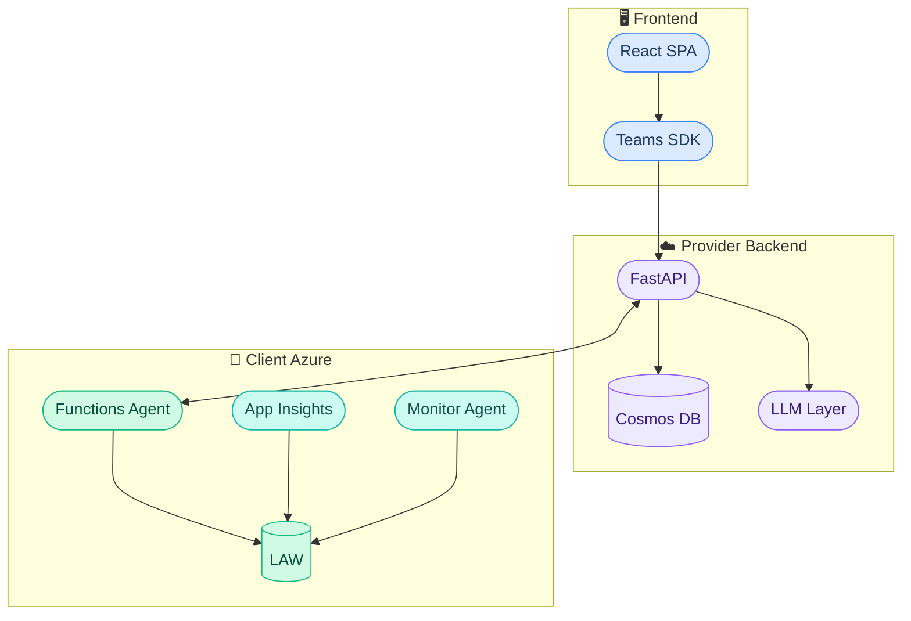
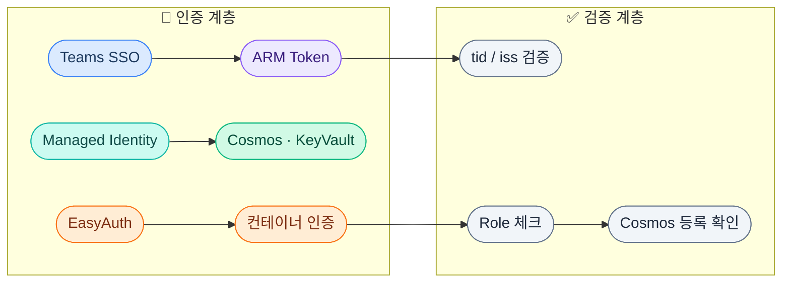
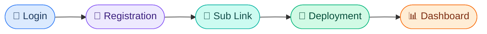
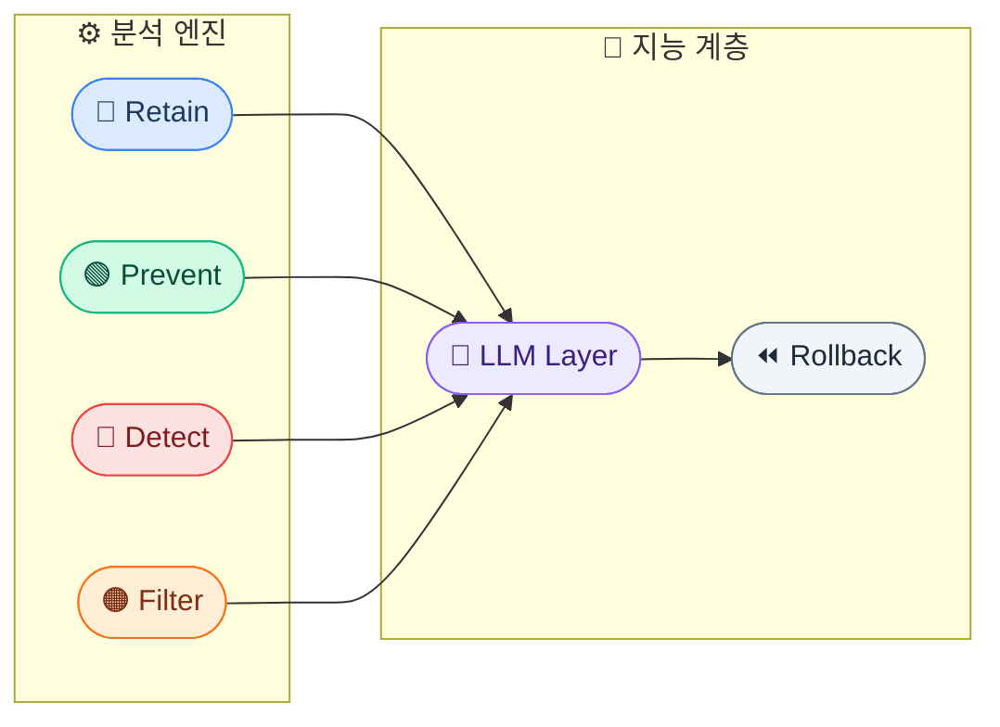
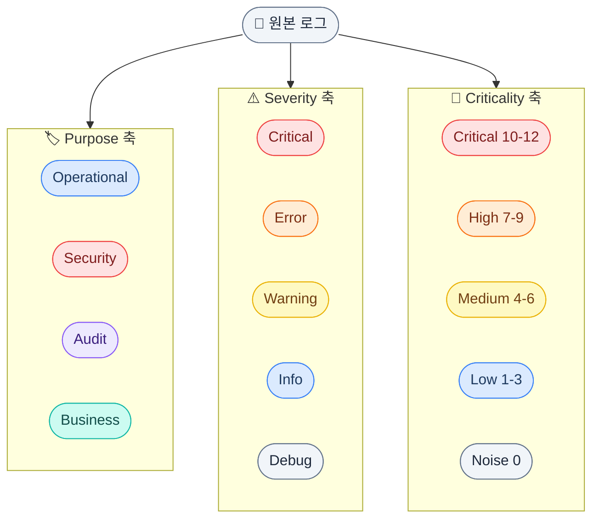
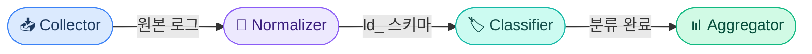
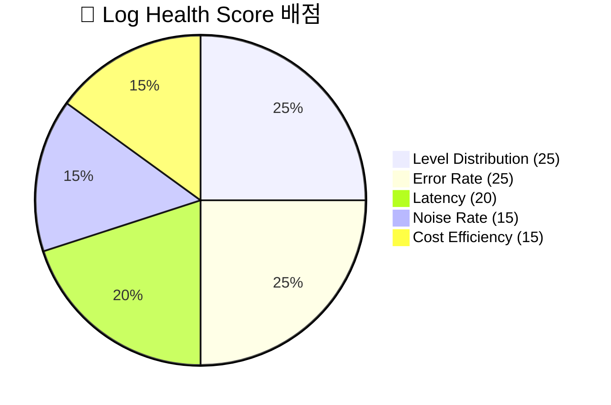
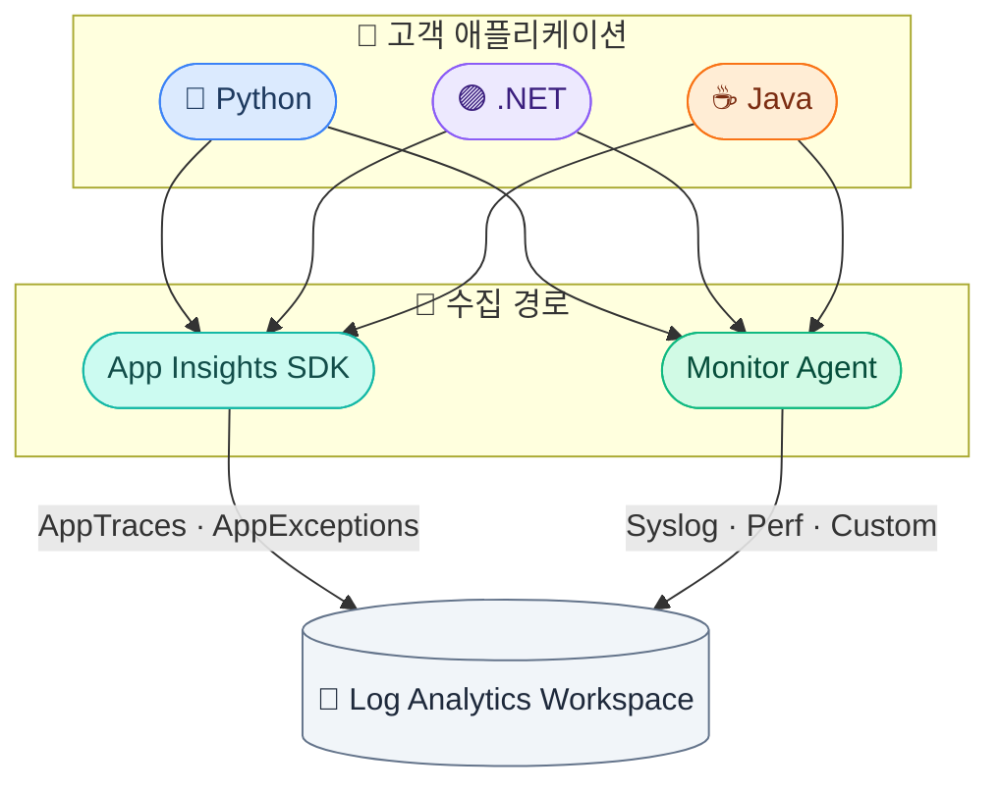

# Log Doctor 프로젝트 설계 통합 요약

---

## 🏗️ 시스템 아키텍처 개요



### 3-컴포넌트 하이브리드 배포
| 컴포넌트 | 위치 | 기술 | 역할 |
|----------|------|------|------|
| **Frontend** | Teams Platform | React + Teams SDK | UI, SSO, 구독 선택 |
| **Provider Backend** | 서비스 제공자 Azure | FastAPI + Container Apps + Cosmos DB | API, 정책 관리, LLM |
| **Client Agent** | 고객 Azure | Azure Functions | 로그 분석 & 엔진 실행 |

---

## 🔐 보안 아키텍처 (Zero-Trust)



- **인증 레이어**: Teams SSO → OBO → Managed Identity (시크릿 제로)
- **EasyAuth**: Container Apps 수준에서 자동 인증 처리
- **토큰 검증**: `tid`(테넌트), `iss`(발급자), `aud`(대상), `roles` 모두 체크
- **토큰 종류**: Teams SSO, OBO ARM, Managed Identity, Federated(GitHub OIDC)

---

## 🔄 온보딩 플로우 (17단계)



> Login: SSO → OBO → Token 검증 / Deployment: Bicep → Agent 생성 → Handshake

### Cosmos DB 데이터 구조
| 컬렉션 | PK | 주요 필드 |
|---------|-----|----------|
| `tenants` | `/tenant_id` | tenant_name, admin_email, plan, created_at |
| `subscriptions` | `/tenant_id` | subscription_id, display_name, status |
| `agents` | `/tenant_id` | agent_id, subscription_id, status, last_heartbeat |

---

## 🎯 6대 핵심 엔진



### 엔진 상세

| 엔진 | 목적 | Provider 역할 | Agent 역할 |
|------|------|--------------|------------|
| **Retain** | 비용 최적화 | Class A/B/C 분류 정책 | 보존 기간 적용, Blob 아카이빙 |
| **Prevent** | 로그 품질 | Debug 비율/빈도/크기 검사 정책 | 로그 패턴 분석 & 리포트 |
| **Detect** | 보안 위협 | IP 이상/경로 스캔/인증 남용 규칙 | 실시간 탐지 & 알림 |
| **Filter** | 노이즈 제거 | DCR 규칙 생성 | 수집 시점 필터링 적용 |
| **LLM** | 자동 제안 | 진단 결과 기반 정책 제안 | - |
| **Rollback** | 안전 복원 | 설정 스냅샷 관리 | 원클릭 복원 실행 |

### 엔진 우선순위 체인
```
Detect(보안) > Retain(비용) > Filter(노이즈) > Prevent(품질)
```
> 보안은 항상 최우선 — 보안 로그는 다른 엔진이 삭제/필터 불가

---

## 📊 로그 표준화 체계

### 3축 분류 모델



### 4개 레이어
| 레이어 | 수집 경로 | 대표 테이블 |
|--------|----------|------------|
| Infrastructure | AMA / Diagnostic Settings | Syslog, AzureDiagnostics |
| Runtime | AMA / Diagnostic Settings | ContainerAppConsoleLogs, FunctionAppLogs |
| Application | Application Insights SDK | AppTraces, AppExceptions, AppRequests |
| Security | Sentinel / Diagnostic Settings | SecurityEvent, SigninLogs |

### `ld_` 정규화 스키마
```
ld_timestamp, ld_source, ld_layer, ld_level, ld_purpose,
ld_criticality_score, ld_criticality_grade, ld_category,
ld_message, ld_resource_id, ld_operation_name, ld_raw
```

---

## 🔬 진단 시스템

### 진단 vs 엔진 분리 원칙
```
진단(Diagnosis) = "상태 파악" → 독립 실행, 결과 저장
엔진(Engine) = "조치 실행" → 진단 결과 참조, 별도 스케줄
```

### 진단 파이프라인



### 모듈 구조
| 모듈 | 역할 | 입력 | 출력 |
|------|------|------|------|
| `table_registry.py` | 15+ LAW 테이블 매핑 정의 | - | 테이블별 필드 매핑 |
| `collector.py` | KQL로 LAW 데이터 수집 | subscription_id, 기간 | 원본 로그 리스트 |
| `normalizer.py` | `ld_` 스키마로 변환 | 원본 로그 | 정규화된 로그 |
| `classifier.py` | 레이어/목적/심각도 분류 | 정규화 로그 | 분류된 로그 |
| `aggregator.py` | 통계/점수 산출 | 분류된 로그 | 건강 점수 |
| `runner.py` | 파이프라인 오케스트레이션 | config | 최종 리포트 |

### Function App 트리거 구조
| 트리거 | 유형 | 주기/조건 |
|--------|------|----------|
| `diagnosis_trigger` | QueueTrigger | 진단 요청 시 |
| `retain_trigger` | TimerTrigger | 매일 |
| `detect_trigger` | TimerTrigger | 5분 간격 |
| `filter_trigger` | QueueTrigger | 정책 변경 시 |
| `prevent_trigger` | TimerTrigger | 매주 |

---

## 📈 Log Health Score (100점 만점)



| 지표 | 배점 | 측정 기준 |
|------|------|----------|
| **Level Distribution** | 25점 | Debug/Trace 비율 (30% 초과 시 감점) |
| **Error Rate** | 25점 | 5xx 에러, 의존성 실패, 예외 비율 |
| **Latency** | 20점 | Request/SQL/HTTP P95 응답시간 |
| **Noise Rate** | 15점 | 반복 로그 패턴 비율 |
| **Cost Efficiency** | 15점 | Class C(저가치) 로그 비율 |

**등급**: A(90-100), B(80-89), C(70-79), D(40-69), F(0-39)

---

## 🔗 데이터 수집 경로



### 프레임워크 정규화 (핵심 인사이트)
- **Python/C#/Java** → Application Insights가 "번역기" 역할
- 모든 프레임워크가 **동일한 LAW 스키마**로 저장됨
- KQL 쿼리는 **프레임워크 무관** — 하나의 진단 파이프라인으로 충분
- 프레임워크 감지는 인사이트 생성 단계에서만 필요 (점수 산출엔 불필요)

---

## 🚀 구현 로드맵

### Phase 1: 순수 Python 진단
- Collector → Normalizer → Classifier → Aggregator
- 로컬 테스트, LAW 미연동

### Phase 2: LAW 통합
- 실제 KQL 쿼리로 LAW 데이터 수집
- Table Registry 기반 15+ 테이블 지원

### Phase 3: Provider 연동
- Function App 배포 (diagnosis_trigger + 4개 엔진 트리거)
- Cosmos DB 결과 저장, Provider API 연동
- LLM Intelligence Layer 통합
