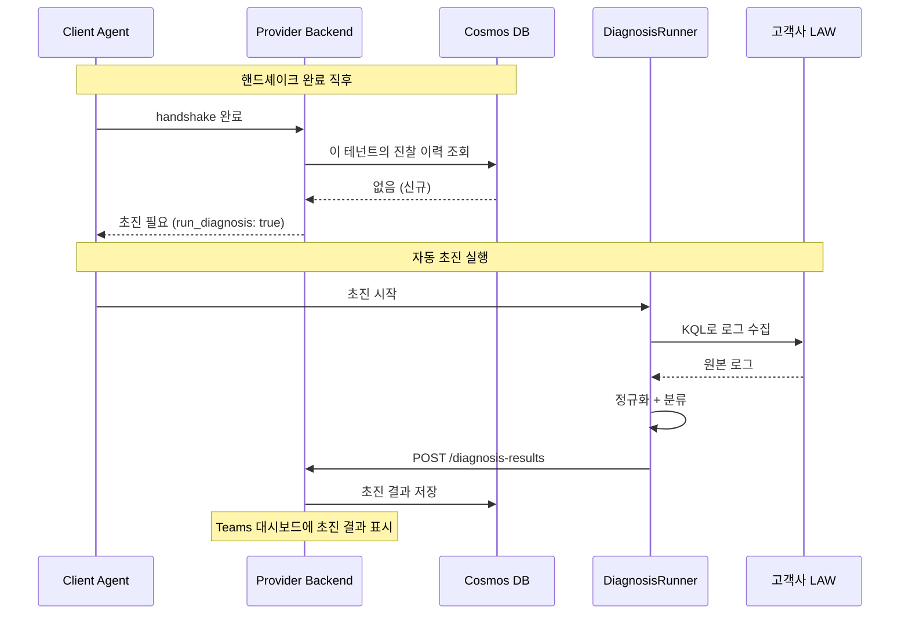
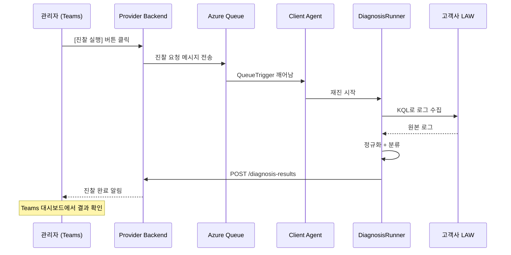
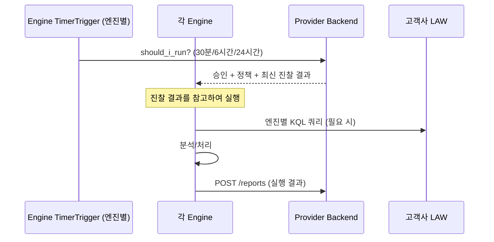
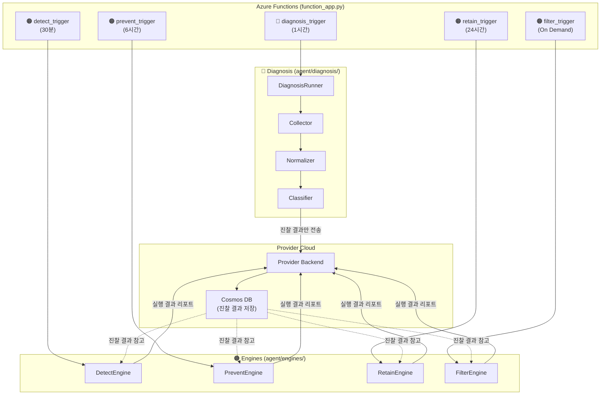

# Log Doctor: 진찰 → 구현 가이드

> Log Doctor는 **로그를 진찰(Diagnosis)하는 서비스**입니다.
> 의사가 환자를 진찰할 때 "어디가 아픈지 → 검사 → 판단 → 처방" 순서가 있듯이,
> Log Doctor도 "로그 수집 → 정규화 → 분류 → 엔진 실행" 순서로 동작합니다.
>
> 이 문서는 [log-standardization.md](log-standardization.md)의 표준화 개념을  
> `log-doctor-client-back` 코드에 **어디에 어떻게 구현하는가**를 설명합니다.

---

## 1. 핵심 원칙: 진찰과 처방은 분리한다

```
❌ 잘못된 설계: 진찰 → 바로 엔진 실행 (한 파이프라인에 직접 연결)

  TimerTrigger → 수집 → 정규화 → 분류 → 바로 Detect/Retain/Filter/Prevent 실행
                                          (한 번에 전부 실행됨)

  문제점:
  ├── 진찰만 하고 싶어도 엔진이 같이 돌아감
  ├── 엔진 하나가 실패하면 진찰도 다시 해야 함
  ├── 진찰 결과를 다른 곳(Provider, Teams)에서 활용 불가
  └── 엔진 실행 주기가 다른데 (Detect 30분, Retain 24시간) 강제로 같이 돌아감
```

```
✅ 올바른 설계: 진찰과 엔진을 완전 분리

  [진찰 프로세스]                    [엔진 프로세스]
  TimerTrigger (1시간)              TimerTrigger (엔진별 다름)
       │                                │
  수집 → 정규화 → 분류              Provider에서 정책 수신
       │                                │
  결과를 저장소에 저장 ──────────→ 저장된 진찰 결과를 읽어서 실행
  (Cosmos DB or Provider)

  장점:
  ├── 진찰만 돌려서 "현재 상태 파악"만 가능 (보고서 전용)
  ├── 엔진마다 다른 주기로 실행 가능 (Detect 30분, Retain 24시간)
  ├── 진찰 결과를 Teams 대시보드에서 바로 조회 가능
  ├── 엔진 실패해도 진찰 결과는 보존됨
  └── LLM이 진찰 결과를 읽어서 Suggestion 생성 가능
```

> [!IMPORTANT] 핵심 규칙
> **진찰(Diagnosis)은 "현재 상태를 파악하고 기록"하는 것이지, 직접 무언가를 실행하지 않는다.**
> 엔진은 진찰 결과를 **참고**하여 독립적으로 실행한다.

---

## 2. 의사 비유로 이해하기

```
의사의 진찰 과정                        Log Doctor의 진단 과정
────────────                           ────────────
① 환자가 처음 온다 (초진)               ① 테넌트 등록 (초진 — 자동)
   └ "첫 방문이시네요, 기초검사 합시다"      └ Cosmos에 진찰 이력 없음 → 자동 초진 실행

   또는                                  또는

   환자가 다시 온다 (재진)               ① 관리자가 [진찰 실행] 버튼 클릭 (재진 — 수동)
   └ "다시 검진받으러 왔습니다"              └ Teams 대시보드 → Queue 메시지 → Agent

② 기초 검사 (혈압, 체온)                ② 로그 수집 (Log Collector)
   └ 표준 장비로 수치화                    └ LAW에서 KQL로 수집 → ld_ 스키마로 정규화

③ 분류 (내과? 외과? 정형?)              ③ 분류 (Classifier)
   └ 증상에 따라 전문 분과로 분류          └ 목적/심각도/중요도로 분류

④ 진단서 발급 ← 여기서 끝!              ④ 진찰 결과 저장 ← 여기서 끝!
   └ 차트에 기록                           └ Provider에 결과 전송 / Cosmos에 저장

       ↕ 시간 차이 (바로 연결 안 됨)            ↕ 시간 차이 (바로 연결 안 됨)

⑤ 전문의가 차트를 보고 진료              ⑤ 엔진이 진찰 결과를 보고 실행
   ├ 내과: "혈당 높으니 관리"             ├ Retain: "이 로그 보존 기간 재설정"
   ├ 외과: "수술 필요"                   ├ Detect: "이 패턴 공격 징후"
   └ 피부과: "연고 처방"                 ├ Prevent: "Debug 레벨 너무 많음"
                                        └ Filter: "이 노이즈 삭제 추천"

⑥ 처방전 발급                          ⑥ 리포트 전송
   └ 약국에 보냄                          └ Provider에 결과 보고 → Teams 대시보드
```

---

## 3. 코드 구조: 진찰과 엔진 완전 분리

```
log-doctor-client-back/
├── function_app.py                  ← Azure Functions 진입점
│
└── agent/
    ├── handshake.py                 ← Provider 등록/인증
    ├── core/
    │   └── config.py
    │
    ├── diagnosis/                   ← 🔵 진찰 (독립 프로세스)
    │   ├── __init__.py
    │   ├── runner.py                ← 진찰 실행 오케스트레이터
    │   ├── collector.py             ← LAW에서 로그 수집
    │   ├── normalizer.py            ← 원본 → ld_ 스키마 변환
    │   ├── classifier.py            ← 목적/심각도/중요도 배정
    │   └── mapping/
    │       └── table_registry.py    ← LAW 테이블 → 레이어/심각도 매핑
    │
    ├── engines/                     ← 🟠 엔진 (독립 프로세스, 진찰과 별개)
    │   ├── base.py                  ← BaseEngine
    │   ├── detect.py                ← 보안 위협 탐지
    │   ├── filter.py                ← 노이즈 필터링
    │   ├── prevent.py               ← 로그 품질 분석
    │   └── retain.py                ← 보존 관리
    │
    └── infra/
        ├── auth.py                  ← Managed Identity
        ├── azure.py                 ← AzureClient (LAW)
        └── provider.py              ← ProviderClient
```

> [!NOTE] `pipeline.py` 제거
> 진찰과 엔진이 분리되면 하나의 Pipeline으로 묶을 이유가 없습니다.
> 대신 `diagnosis/runner.py`와 각 엔진이 독립 실행됩니다.

---

## 4. 실행 흐름: 두 개의 독립 프로세스

### 4-1. 초진 — 자동 진찰 (First Diagnosis)

테넌트 등록/Agent 핸드셰이크 직후, Cosmos에 진찰 이력이 없으면 자동 실행됩니다.



### 4-2. 재진 — 버튼 클릭 진찰 (On-Demand Diagnosis)

관리자가 Teams 대시보드에서 **[진찰 실행]** 버튼을 누르면 실행됩니다.



### 4-3. 엔진 프로세스 (Engines)

엔진은 진찰과 별개로 각자의 주기에 따라 독립 실행됩니다.



---

## 5. function_app.py — 트리거 분리

```python
# function_app.py — 진찰과 엔진이 별도 트리거

app = func.FunctionApp()
azure_client = AzureClient()
provider_client = ProviderClient()

# ──────────────────────────────────────────────
# 🔵 진찰: On-Demand (버튼 클릭 → Queue) + 초진 자동
# ──────────────────────────────────────────────
@app.queue_trigger(arg_name="msg", queue_name="diagnosis-requests",
                   connection="AzureWebJobsStorage")
async def diagnosis_trigger(msg: func.QueueMessage):
    """
    진찰 전용 트리거 (On-Demand).
    - 초진: handshake 시 Provider가 Cosmos 조회 → 이력 없으면 Queue에 메시지 전송
    - 재진: 관리자가 Teams [진찰 실행] 버튼 → Provider → Queue
    결과: LAW 수집 → 정규화 → 분류 → Provider에 결과만 저장.
    """
    await perform_idempotent_handshake()

    runner = DiagnosisRunner(azure_client)
    diagnosis_result = await runner.run()

    # 진찰 결과만 Provider에 전송 (엔진 실행 X)
    await provider_client.submit_diagnosis(diagnosis_result)


# ──────────────────────────────────────────────
# 🟠 엔진 트리거들: 각각 다른 주기. 진찰 결과를 참고만 함.
# ──────────────────────────────────────────────
@app.timer_trigger(arg_name="mytimer", schedule="0 */30 * * * *")
async def detect_trigger(mytimer: func.TimerRequest):
    """Detect 엔진 — 30분 주기 (보안 위협은 빠른 감지 필요)"""
    if await provider_client.should_i_run("detect"):
        policies = await provider_client.get_policies("detect")
        engine = DetectEngine(azure_client)
        result = await engine.run(policies)
        await provider_client.report_result("detect", result)


@app.timer_trigger(arg_name="mytimer", schedule="0 0 */6 * * *")
async def prevent_trigger(mytimer: func.TimerRequest):
    """Prevent 엔진 — 6시간 주기"""
    if await provider_client.should_i_run("prevent"):
        policies = await provider_client.get_policies("prevent")
        engine = PreventEngine(azure_client)
        result = await engine.run(policies)
        await provider_client.report_result("prevent", result)


@app.timer_trigger(arg_name="mytimer", schedule="0 0 0 * * *")
async def retain_trigger(mytimer: func.TimerRequest):
    """Retain 엔진 — 24시간 주기"""
    if await provider_client.should_i_run("retain"):
        policies = await provider_client.get_policies("retain")
        engine = RetainEngine(azure_client)
        result = await engine.run(policies)
        await provider_client.report_result("retain", result)


@app.queue_trigger(arg_name="msg", queue_name="filter-requests",
                   connection="AzureWebJobsStorage")
async def filter_trigger(msg: func.QueueMessage):
    """Filter 엔진 — On Demand (관리자가 요청 시)"""
    policies = await provider_client.get_policies("filter")
    engine = FilterEngine(azure_client)
    result = await engine.run(policies)
    await provider_client.report_result("filter", result)
```

---

## 6. 진찰 결과의 흐름

```
진찰 결과가 어디로 흘러가는가:

  Diagnosis Runner
       │
       ▼
  Provider Backend (Cosmos DB에 저장)
       │
       ├──→ Teams 대시보드: "현재 고객사 로그 상태" 조회
       │       └ 보안 로그 비율, 중요도별 분포, 노이즈 비율 등
       │
       ├──→ 각 Engine: should_i_run 응답에 최신 진찰 결과 포함
       │       └ Detect: "보안 로그 목록 여기 있음"
       │       └ Filter: "Noise 로그 목록 여기 있음"
       │       └ Retain: "중요도별 보존 등급 여기 있음"
       │
       └──→ LLM Layer: 진찰 결과 기반 Suggestion 생성
               └ "이 로그는 Class A로 올려야 합니다" 등
```

---

## 7. 진찰 결과 데이터 구조

Provider에 전송하는 진찰 결과의 형태:

```json
{
  "tenant_id": "tenant-abc",
  "agent_id": "agent-xyz",
  "diagnosed_at": "2026-02-25T15:00:00+09:00",

  "summary": {
    "total_logs_analyzed": 15420,
    "tables_scanned": ["AppTraces", "SigninLogs", "AzureActivity", "..."],
    "time_range_hours": 1
  },

  "distribution": {
    "by_layer": {
      "infrastructure": 2100,
      "runtime": 5200,
      "application": 7500,
      "security": 620
    },
    "by_criticality": {
      "critical": 620,
      "high": 1300,
      "medium": 3500,
      "low": 4200,
      "noise": 5800
    },
    "by_severity": {
      "ERROR": 450,
      "WARNING": 1200,
      "INFO": 8500,
      "DEBUG": 4200,
      "TRACE": 1070
    }
  },

  "engine_hints": {
    "detect": {
      "security_log_count": 620,
      "suspicious_patterns_found": 3
    },
    "retain": {
      "class_a_count": 620,
      "class_b_count": 4800,
      "class_c_count": 10000
    },
    "filter": {
      "noise_log_count": 5800,
      "estimated_cost_savings_percent": 37.6
    },
    "prevent": {
      "debug_in_production_count": 4200,
      "oversized_logs_count": 15
    }
  }
}
```

---

## 8. 전체 아키텍처 다이어그램



---

## 9. 구현 순서 (추천)

| 순서 | 대상 | 모듈 | 난이도 | 이유 |
| :---: | :---: | --- | :---: | --- |
| 1 | 진찰 | `mapping/table_registry.py` | 낮음 | 순수 데이터 정의 (LAW 테이블 매핑) |
| 2 | 진찰 | `normalizer.py` | 낮음 | 변환 로직, 테스트 쉬움 |
| 3 | 진찰 | `classifier.py` | 중간 | 점수 계산, 경계값 조정 |
| 4 | 진찰 | `collector.py` | 중간 | LAW KQL 연동, 페이징 처리 |
| 5 | 진찰 | `runner.py` | 낮음 | 위 모듈 조합 |
| — | — | — | — | **↑ 여기까지 진찰. ↓ 여기부터 엔진.** |
| 6 | 엔진 | `detect.py` | 높음 | 보안 위협 탐지 로직 |
| 7 | 엔진 | `retain.py` | 중간 | 보존 정책 적용 + Blob export |
| 8 | 엔진 | `prevent.py` | 중간 | 로그 패턴 분석 |
| 9 | 엔진 | `filter.py` | 높음 | DCR 제어 (가장 마지막) |

> [!TIP] 진찰(1~5번)을 먼저 완성하면, 엔진을 하나도 안 만들어도 **"현재 고객사 로그 상태 리포트"** 기능이 바로 동작합니다.
> Teams 대시보드에서 "노이즈 비율 37.6%, Debug 로그 4200건" 같은 현황을 볼 수 있습니다.
