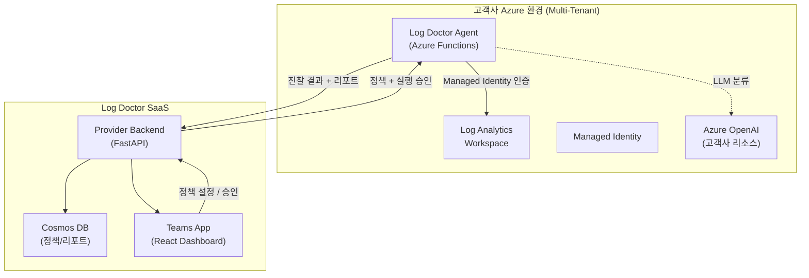

# Log Doctor — Azure 로그 최적화 SaaS

> **한 줄 요약**: 고객사의 Azure Log Analytics Workspace(LAW)를 자동으로 진찰하여, 로그 비용을 절감하고 보안 위협을 탐지하는 멀티테넌트 SaaS 서비스.

---

## 💡 해결하는 문제

```
Azure를 사용하는 기업의 현실:

  "매달 LAW 비용이 왜 이렇게 나오지?"                ← 비용
  "로그가 너무 많아서 중요한 게 뭔지 모르겠다"          ← 노이즈
  "보안 로그를 1년 보존해야 하는데 어떻게 하지?"        ← 컴플라이언스
  "Debug 로그가 프로덕션에서 쏟아지고 있었다고?"        ← 로그 품질
  "공격이 있었는데 로그를 나중에야 알았다"              ← 탐지 지연

  → 대부분의 기업이 로그를 "수집은 하지만 관리는 안 하고" 있음
```

---

## 🏗️ 아키텍처 한눈에 보기



> **핵심**: 고객 데이터는 고객 환경 밖으로 나가지 않습니다 (Data Sovereignty).
> Agent가 고객사 내부에서 분석하고, **결과(메타데이터)만** Provider에 전송합니다.

---

## ⚙️ 5가지 핵심 기능

| # | 기능 | 하는 일 | 비유 |
|---|------|---------|------|
| 🔵 | **진찰 (Diagnosis)** | 로그 수집 → 정규화 → 분류 → 현황 리포트 | 건강검진 |
| 1 | **Retain** (보존) | 중요도별 보존 기간 관리 + Blob Archive | 약 유효기간 관리 |
| 2 | **Prevent** (예방) | Debug-in-prod, 과다 로깅 감지 → 팀에 권고 | 생활습관 개선 |
| 3 | **Detect** (탐지) | 보안 위협 패턴 탐지 → 인시던트 생성 | MRI 정밀검사 |
| 4 | **Filter** (필터) | 노이즈 로그 수집 차단 (DCR 제어) | 건강한 식단 필터 |
| 🤖 | **LLM Layer** | 위 4개 엔진의 규칙을 자동 제안 (Human-in-the-loop) | AI 보조 진단 |

---

## 🔐 보안 설계

| 항목 | 방식 |
|------|------|
| **인증** | Managed Identity (Zero Secret) |
| **데이터 주권** | Agent가 고객 환경 내부에서만 원본 접근 |
| **통신** | Provider ↔ Agent: OBO 토큰 교환 |
| **LLM** | Azure OpenAI가 고객사 구독에 배포 (원본 로그 외부 전송 X) |
| **변경 안전** | 모든 설정 변경 전 스냅샷 저장, Teams에서 원클릭 원복 |

---

## 💰 비용 절감 효과 (예시)

```
고객사 A: 일 10GB 로그 발생

  Before Log Doctor:
  ├── 모든 로그 LAW 30일 보존
  ├── 월 비용: ~$828/월
  └── Debug 로그가 70% 차지 (쓸데없는 비용)

  After Log Doctor:
  ├── 진찰: Debug 로그 70%, 노이즈 30% 식별
  ├── Filter: 노이즈 30% 수집 차단            → -30%
  ├── Retain: Debug 7일 보존 + 나머지 Archive  → -45%
  ├── Prevent: Debug-in-prod 알림 → 개발팀 수정 → -15%
  └── 월 비용: ~$200/월 (약 75% 절감)
```

---

## 🧱 기술 스택

| 구성 요소 | 기술 | 이유 |
|-----------|------|------|
| **Provider Backend** | FastAPI (Python) | 비동기 고성능, Azure SDK 호환 |
| **Client Agent** | Azure Functions (Python) | 서버리스, Managed Identity 네이티브 |
| **Frontend** | Teams App (React) | 고객 사용 환경에 자연스럽게 통합 |
| **Database** | Cosmos DB | 멀티테넌트 파티셔닝, 글로벌 배포 |
| **인증** | Entra ID + OBO Flow | 멀티테넌트 SSO |
| **배포** | Bicep 템플릿 | 고객사 에이전트 원클릭 배포 |
| **LLM** | Azure OpenAI (GPT-4o-mini) | 고객사 환경 내 배포, 비용 효율 |

---

## 📦 배포 모델

```
고객이 Log Doctor를 도입하면:

  ① Teams에서 SSO 로그인 (Entra ID)
  ② Bicep 템플릿으로 Agent 원클릭 배포
     └ Azure Functions + Managed Identity 자동 생성
  ③ Agent가 자동으로 Provider에 Handshake
  ④ 진찰 시작 → Teams 대시보드에서 현황 확인
  ⑤ 관리자가 정책 설정 → 엔진 자동 실행

  고객이 할 일: Teams에서 로그인 + 구독 선택 + 배포 버튼 클릭
  나머지는 전부 자동.
```

---

## 🗂️ 코드 저장소

| 저장소 | 역할 | 기술 |
|--------|------|------|
| `log-doctor-provider-back` | Provider Backend API | FastAPI + Cosmos DB |
| `log-doctor-provider-front` | Teams Dashboard App | React |
| `log-doctor-client-back` | Client Agent | Azure Functions (Python) |
| `log-doctor-document` | 프로젝트 문서 | Markdown |

---

## 📊 현재 진행 상황

| 구간 | 상태 | 비고 |
|------|:----:|------|
| Provider Backend 기본 구조 | ✅ 완료 | FastAPI + Cosmos DB + Entra ID 인증 |
| Teams App 기본 구조 | ✅ 완료 | SSO + 테넌트 등록 |
| Client Agent 기본 구조 | ✅ 완료 | Timer/Queue Trigger + Handshake |
| 로그 표준화 설계 | ✅ 완료 | 3차원 분류 + ld_ 스키마 + 엔진 우선순위 |
| 진찰 모듈 구현 | 🔲 다음 | Collector → Normalizer → Classifier |
| 4개 엔진 구현 | 🔲 대기 | 진찰 완료 후 순차 착수 |
| LLM Layer | 🔲 대기 | 엔진 안정화 후 |

---

## ❓ Microsoft에 묻고 싶은 것

1. **LAW Purge API 대량 호출 시 throttling 정책** — Retain 엔진이 대량 로그 삭제 시 제한 사항
2. **DCR(Data Collection Rule) 동적 수정 API** — Filter 엔진이 실시간으로 DCR 규칙을 업데이트할 때의 모범 사례
3. **멀티테넌트 Azure Functions 배포 패턴** — Bicep 템플릿으로 고객사별 Agent를 효율적으로 배포하는 권장 방법
4. **Azure OpenAI 고객사 구독 배포** — 데이터 레지던시를 지키면서 LLM을 고객사 환경에 배포하는 패턴
