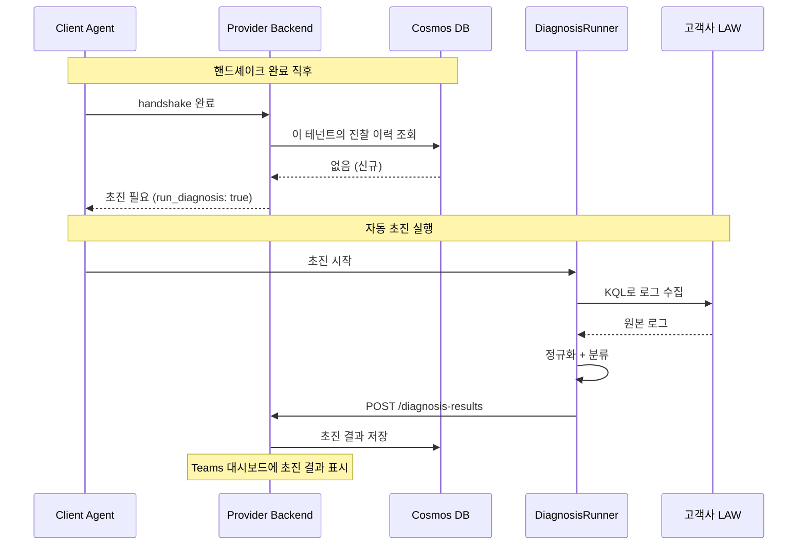
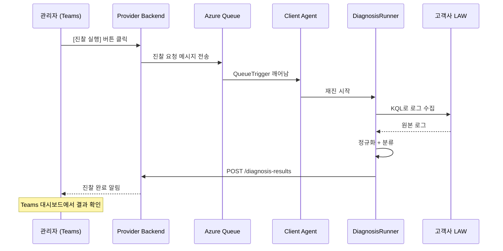
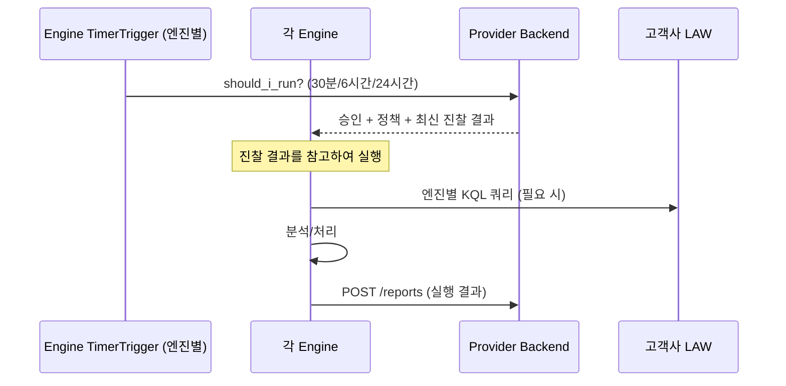
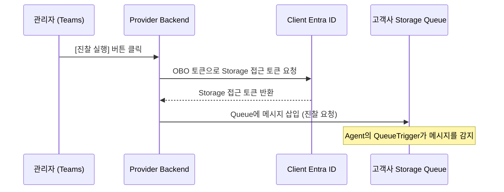
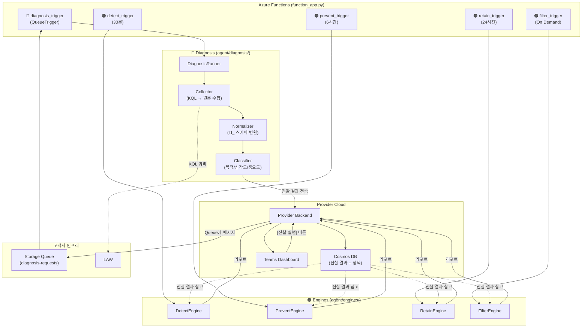

# Log Doctor: 진찰 → 구현 가이드

> Log Doctor는 **로그를 진찰(Diagnosis)하는 서비스**입니다.
> 의사가 환자를 진찰할 때 "어디가 아픈지 → 검사 → 판단 → 처방" 순서가 있듯이,
> Log Doctor도 "로그 수집 → 정규화 → 분류 → 엔진 실행" 순서로 동작합니다.
>
> 이 문서는 [log-standardization.md](log-standardization.md)의 표준화 개념을  
> `log-doctor-client-back` 코드에 **어디에 어떻게 구현하는가**를 설명합니다.

---

## 1. 핵심 원칙: 진찰과 처방은 분리한다

```
❌ 잘못된 설계: 진찰 → 바로 엔진 실행 (한 파이프라인에 직접 연결)

  TimerTrigger → 수집 → 정규화 → 분류 → 바로 Detect/Retain/Filter/Prevent 실행
                                          (한 번에 전부 실행됨)

  문제점:
  ├── 진찰만 하고 싶어도 엔진이 같이 돌아감
  ├── 엔진 하나가 실패하면 진찰도 다시 해야 함
  ├── 진찰 결과를 다른 곳(Provider, Teams)에서 활용 불가
  └── 엔진 실행 주기가 다른데 (Detect 30분, Retain 24시간) 강제로 같이 돌아감
```

```
✅ 올바른 설계: 진찰과 엔진을 완전 분리

  [진찰 프로세스]                    [엔진 프로세스]
  초진: 자동 (이력 없을 때)           TimerTrigger (엔진별 다름)
  재진: 버튼 클릭 (On-Demand)              │
       │                            Provider에서 정책 수신
  수집 → 정규화 → 분류                     │
       │                            저장된 진찰 결과를 읽어서 실행
  결과를 Provider에 전송 ──────────→ (진찰 결과 = 엔진의 "참고 자료")
  (Cosmos DB에 저장)

  장점:
  ├── 진찰만 돌려서 "현재 상태 파악"만 가능 (보고서 전용)
  ├── 엔진마다 다른 주기로 실행 가능 (Detect 30분, Retain 24시간)
  ├── 진찰 결과를 Teams 대시보드에서 바로 조회 가능
  ├── 엔진 실패해도 진찰 결과는 보존됨
  └── LLM이 진찰 결과를 읽어서 Suggestion 생성 가능
```

> [!IMPORTANT] 핵심 규칙
> **진찰(Diagnosis)은 "현재 상태를 파악하고 기록"하는 것이지, 직접 무언가를 실행하지 않는다.**
> 엔진은 진찰 결과를 **참고**하여 독립적으로 실행한다.

---

## 2. 진찰 비유: 의사 vs Log Doctor

```
의사의 진찰 과정                        Log Doctor의 진단 과정
────────────                           ────────────
① 환자가 처음 온다 (초진)               ① 테넌트 등록 (초진 — 자동)
   └ "첫 방문이시네요, 기초검사 합시다"      └ Cosmos에 진찰 이력 없음 → 자동 초진 실행

   또는                                  또는

   환자가 다시 온다 (재진)               ① 관리자가 [진찰 실행] 버튼 클릭 (재진 — 수동)
   └ "다시 검진받으러 왔습니다"              └ Teams 대시보드 → Queue 메시지 → Agent

② 기초 검사 (혈압, 체온)                ② 로그 수집 (Log Collector)
   └ 표준 장비로 수치화                    └ LAW에서 KQL로 수집 → ld_ 스키마로 정규화

③ 분류 (내과? 외과? 정형?)              ③ 분류 (Classifier)
   └ 증상에 따라 전문 분과로 분류          └ 목적/심각도/중요도로 분류

④ 진단서 발급 ← 여기서 끝!              ④ 진찰 결과 저장 ← 여기서 끝!
   └ 차트에 기록                           └ Provider에 결과 전송 / Cosmos에 저장

       ↕ 시간 차이 (바로 연결 안 됨)            ↕ 시간 차이 (바로 연결 안 됨)

⑤ 전문의가 차트를 보고 진료              ⑤ 엔진이 진찰 결과를 보고 실행
   ├ 내과: "혈당 높으니 관리"             ├ Retain: "이 로그 보존 기간 재설정"
   ├ 외과: "수술 필요"                   ├ Detect: "이 패턴 공격 징후"
   └ 피부과: "연고 처방"                 ├ Prevent: "Debug 레벨 너무 많음"
                                        └ Filter: "이 노이즈 삭제 추천"

⑥ 처방전 발급                          ⑥ 리포트 전송
   └ 약국에 보냄                          └ Provider에 결과 보고 → Teams 대시보드
```

---

## 3. 코드 구조: 진찰과 엔진 완전 분리

```
log-doctor-client-back/
├── function_app.py                  ← Azure Functions 진입점
│
└── agent/
    ├── handshake.py                 ← Provider 등록/인증
    ├── core/
    │   └── config.py
    │
    ├── diagnosis/                   ← 🔵 진찰 (독립 프로세스)
    │   ├── __init__.py
    │   ├── runner.py                ← 진찰 실행 오케스트레이터
    │   ├── collector.py             ← LAW에서 로그 수집
    │   ├── normalizer.py            ← 원본 → ld_ 스키마 변환
    │   ├── classifier.py            ← 목적/심각도/중요도 배정
    │   └── mapping/
    │       └── table_registry.py    ← LAW 테이블 → 레이어/심각도 매핑
    │
    ├── engines/                     ← 🟠 엔진 (독립 프로세스, 진찰과 별개)
    │   ├── base.py                  ← BaseEngine
    │   ├── detect.py                ← 보안 위협 탐지
    │   ├── filter.py                ← 노이즈 필터링
    │   ├── prevent.py               ← 로그 품질 분석
    │   └── retain.py                ← 보존 관리
    │
    └── infra/
        ├── auth.py                  ← Managed Identity
        ├── azure.py                 ← AzureClient (LAW)
        └── provider.py              ← ProviderClient
```

> [!NOTE] `pipeline.py` 제거
> 진찰과 엔진이 분리되면 하나의 Pipeline으로 묶을 이유가 없습니다.
> 대신 `diagnosis/runner.py`와 각 엔진이 독립 실행됩니다.

---

## 4. 실행 흐름: 초진 / 재진 / 엔진

### 4-1. 초진 — 자동 진찰 (First Diagnosis)

테넌트 등록/Agent 핸드셰이크 직후, Cosmos에 진찰 이력이 없으면 자동 실행됩니다.



### 4-2. 재진 — 버튼 클릭 진찰 (On-Demand Diagnosis)

관리자가 Teams 대시보드에서 **[진찰 실행]** 버튼을 누르면 실행됩니다.



### 4-3. 엔진 프로세스 (Engines)

엔진은 진찰과 별개로 각자의 주기에 따라 독립 실행됩니다.



---

## 5. Queue 인프라: 진찰 요청이 Agent에 도달하는 방법

### 5-1. AzureWebJobsStorage란?

Azure Functions를 배포하면 **자동으로 생성되는 Storage Account**입니다. 별도로 만들 필요 없습니다.

```
Azure Functions 배포 시 자동 생성:
├── Azure Functions App (Agent)
├── Storage Account (= AzureWebJobsStorage)   ← 이것!
│   ├── Queue Storage                         ← 진찰/필터 요청 큐
│   │   ├── diagnosis-requests                ← 🔵 진찰 요청 큐
│   │   └── filter-requests                   ← 🟠 필터 엔진 요청 큐
│   ├── Blob Storage                          ← Functions 내부 상태
│   └── Table Storage                         ← Functions 내부용
└── Application Insights (선택)
```

### 5-2. Provider가 고객사 Queue에 접근하는 방법



> [!NOTE] Queue 접근 권한
> Provider가 고객사의 Storage Queue에 메시지를 넣으려면,
> OBO 토큰의 scope에 `https://storage.azure.com/.default`가 포함되어야 합니다.
> 또는 Agent 배포 시 Bicep에서 Provider에게 `Storage Queue Data Message Sender` 역할을 부여합니다.

### 5-3. Queue 메시지 형식

```json
// diagnosis-requests 큐에 들어가는 메시지
{
  "type": "diagnosis",               // "first" (초진) 또는 "manual" (재진)
  "tenant_id": "tenant-abc",
  "subscription_id": "sub-xyz",
  "requested_by": "admin@contoso.com",
  "requested_at": "2026-02-25T17:00:00+09:00",
  "options": {
    "time_range_hours": 1,            // 최근 몇 시간 로그를 수집할지
    "tables": ["all"]                 // "all" 또는 특정 테이블 목록
  }
}
```

---

## 6. 각 모듈의 역할과 상세 구현

### 6-1. Table Registry — LAW 테이블 매핑 정의

LAW에는 수십 개의 기본 테이블이 있습니다. 각 테이블이 어떤 레이어에 속하고, 어떤 필드에서 심각도/메시지를 추출하는지를 정의합니다.

```python
# agent/diagnosis/mapping/table_registry.py

from dataclasses import dataclass
from typing import Callable, Optional

@dataclass
class TableMapping:
    """LAW 테이블 하나에 대한 매핑 정의"""
    table_name: str           # LAW 테이블명
    layer: str                # "infrastructure" | "runtime" | "application" | "security"
    severity_field: str       # 심각도를 추출할 칼럼명
    message_field: str        # 메시지를 추출할 칼럼명
    default_severity: str     # 심각도 필드가 없을 때 기본값
    context_fields: list[str] # 추가 컨텍스트로 추출할 칼럼들

# ─────────────────────────────────────────
# LAW 기본 테이블 매핑
# ─────────────────────────────────────────
TABLE_REGISTRY: dict[str, TableMapping] = {

    # ── Infrastructure Layer ──
    "AzureActivity": TableMapping(
        table_name="AzureActivity",
        layer="infrastructure",
        severity_field="Level",           # "Informational", "Warning", "Error"
        message_field="OperationNameValue",
        default_severity="INFO",
        context_fields=["ResourceGroup", "Caller", "CorrelationId",
                        "SubscriptionId", "ResourceProviderValue"],
    ),
    "AzureMetrics": TableMapping(
        table_name="AzureMetrics",
        layer="infrastructure",
        severity_field="_severity_",      # 없음 → 기본값 사용
        message_field="MetricName",
        default_severity="INFO",
        context_fields=["ResourceId", "Average", "Maximum", "Minimum"],
    ),
    "AzureDiagnostics": TableMapping(
        table_name="AzureDiagnostics",
        layer="infrastructure",
        severity_field="Level",
        message_field="ResultDescription",
        default_severity="INFO",
        context_fields=["ResourceType", "ResourceId", "OperationName"],
    ),

    # ── Runtime Layer ──
    "AppTraces": TableMapping(
        table_name="AppTraces",
        layer="runtime",
        severity_field="SeverityLevel",   # 0=Verbose, 1=Info, 2=Warning, 3=Error, 4=Critical
        message_field="Message",
        default_severity="INFO",
        context_fields=["AppRoleName", "OperationId",
                        "OperationName", "ClientIP"],
    ),
    "AppExceptions": TableMapping(
        table_name="AppExceptions",
        layer="runtime",
        severity_field="SeverityLevel",
        message_field="OuterMessage",
        default_severity="ERROR",         # 예외는 기본 ERROR
        context_fields=["AppRoleName", "ProblemId", "ExceptionType",
                        "Assembly", "Method", "OperationId"],
    ),
    "AppRequests": TableMapping(
        table_name="AppRequests",
        layer="runtime",
        severity_field="_severity_",      # 없음 → ResultCode로 판단
        message_field="Name",
        default_severity="INFO",
        context_fields=["Url", "ResultCode", "DurationMs",
                        "AppRoleName", "OperationId"],
    ),
    "AppDependencies": TableMapping(
        table_name="AppDependencies",
        layer="runtime",
        severity_field="_severity_",      # Success 여부로 판단
        message_field="Name",
        default_severity="INFO",
        context_fields=["DependencyType", "Target", "ResultCode",
                        "DurationMs", "Success"],
    ),

    # ── Application Layer ──
    "ContainerLog": TableMapping(
        table_name="ContainerLog",
        layer="application",
        severity_field="LogEntrySource",  # stdout/stderr
        message_field="LogEntry",
        default_severity="INFO",
        context_fields=["ContainerID", "Computer", "Image"],
    ),
    "Syslog": TableMapping(
        table_name="Syslog",
        layer="application",
        severity_field="SeverityLevel",   # "info", "warning", "err", "crit"
        message_field="SyslogMessage",
        default_severity="INFO",
        context_fields=["Computer", "Facility", "ProcessName"],
    ),
    "FunctionAppLogs": TableMapping(
        table_name="FunctionAppLogs",
        layer="application",
        severity_field="Level",
        message_field="Message",
        default_severity="INFO",
        context_fields=["FunctionName", "HostInstanceId", "Category"],
    ),

    # ── Security Layer ──
    "SigninLogs": TableMapping(
        table_name="SigninLogs",
        layer="security",
        severity_field="ResultType",       # 0=성공, 그 외=실패
        message_field="ResultDescription",
        default_severity="INFO",
        context_fields=["UserPrincipalName", "AppDisplayName",
                        "IPAddress", "Location", "ConditionalAccessStatus"],
    ),
    "AADNonInteractiveUserSignInLogs": TableMapping(
        table_name="AADNonInteractiveUserSignInLogs",
        layer="security",
        severity_field="ResultType",
        message_field="ResultDescription",
        default_severity="INFO",
        context_fields=["UserPrincipalName", "AppDisplayName", "IPAddress"],
    ),
    "SecurityEvent": TableMapping(
        table_name="SecurityEvent",
        layer="security",
        severity_field="Level",
        message_field="Activity",
        default_severity="WARNING",
        context_fields=["EventID", "Account", "Computer",
                        "Process", "LogonType"],
    ),
    "AuditLogs": TableMapping(
        table_name="AuditLogs",
        layer="security",
        severity_field="Result",           # "success", "failure"
        message_field="OperationName",
        default_severity="INFO",
        context_fields=["InitiatedBy", "TargetResources", "Category"],
    ),
}
```

### 6-2. Collector — LAW에서 로그 한 번 수집

```python
# agent/diagnosis/collector.py

import logging
from azure.monitor.query import LogsQueryClient, LogsQueryStatus
from azure.core.exceptions import HttpResponseError
from agent.infra.azure import AzureClient
from .mapping.table_registry import TABLE_REGISTRY

logger = logging.getLogger("Collector")

class LogCollector:
    """LAW에서 원본 로그를 수집하는 책임만 가진다."""

    def __init__(self, azure_client: AzureClient):
        self.azure_client = azure_client

    async def collect(
        self,
        workspace_id: str,
        tables: list[str] | None = None,
        time_range_hours: int = 1,
        max_rows_per_table: int = 5000,
    ) -> list[dict]:
        """
        지정된 테이블에서 최근 N시간 로그를 수집.

        Args:
            workspace_id: LAW 워크스페이스 ID
            tables: 수집할 테이블 목록. None이면 TABLE_REGISTRY의 모든 테이블
            time_range_hours: 최근 몇 시간 데이터를 가져올지
            max_rows_per_table: 테이블당 최대 행 수 (비용/메모리 제어)

        Returns:
            [{"_source_table": "AppTraces", "TimeGenerated": ..., ...}, ...]
        """
        target_tables = tables or list(TABLE_REGISTRY.keys())
        raw_logs = []

        for table in target_tables:
            if table not in TABLE_REGISTRY:
                logger.warning(f"알 수 없는 테이블: {table} — 건너뜀")
                continue

            try:
                kql = (
                    f"{table}"
                    f" | where TimeGenerated > ago({time_range_hours}h)"
                    f" | take {max_rows_per_table}"
                    f" | order by TimeGenerated desc"
                )
                results = await self.azure_client.query_logs(
                    workspace_id, kql
                )

                if results.status == LogsQueryStatus.SUCCESS:
                    for row in results.tables[0].rows:
                        columns = results.tables[0].columns
                        record = {
                            col.name: val
                            for col, val in zip(columns, row)
                        }
                        record["_source_table"] = table
                        raw_logs.append(record)

                    logger.info(f"  ✓ {table}: {len(results.tables[0].rows)}건")

                elif results.status == LogsQueryStatus.PARTIAL:
                    logger.warning(f"  △ {table}: 부분 결과 (타임아웃)")
                    # 부분 결과라도 수집
                    for row in results.partial_data[0].rows:
                        columns = results.partial_data[0].columns
                        record = {
                            col.name: val
                            for col, val in zip(columns, row)
                        }
                        record["_source_table"] = table
                        raw_logs.append(record)

            except HttpResponseError as e:
                if "BadArgumentError" in str(e):
                    # 테이블이 존재하지 않는 경우 (고객사에 해당 리소스가 없음)
                    logger.info(f"  - {table}: 테이블 없음 (건너뜀)")
                else:
                    logger.error(f"  ✗ {table}: 쿼리 실패 — {e}")

        logger.info(f"수집 완료: 총 {len(raw_logs)}건 ({len(target_tables)}개 테이블)")
        return raw_logs
```

> [!NOTE] 테이블이 없는 경우
> 고객사마다 사용하는 Azure 서비스가 다르므로, LAW에 없는 테이블이 있을 수 있습니다.
> 예: Application Insights를 안 쓰면 `AppTraces`, `AppExceptions` 등이 없습니다.
> Collector는 이를 **에러가 아닌 정상 상황**으로 처리하고 건너뜁니다.

### 6-3. Normalizer — ld_ 스키마로 변환

```python
# agent/diagnosis/normalizer.py

import logging
from .mapping.table_registry import TABLE_REGISTRY, TableMapping

logger = logging.getLogger("Normalizer")

# ─────────────────────────────────────────
# 심각도 정규화 매핑
# LAW 테이블마다 심각도 표현이 다르다:
#   AppTraces: 0, 1, 2, 3, 4 (숫자)
#   AzureActivity: "Informational", "Warning", "Error" (문자열)
#   Syslog: "info", "warning", "err", "crit" (소문자)
#   SigninLogs: ResultType 0=성공, 나머지=실패 (코드)
# 이를 통일된 5단계로 변환한다.
# ─────────────────────────────────────────
SEVERITY_MAP = {
    # AppTraces / AppExceptions (SeverityLevel — 숫자)
    "0": "TRACE", "verbose": "TRACE",
    "1": "INFO",  "information": "INFO", "informational": "INFO",
    "2": "WARNING", "warning": "WARNING", "warn": "WARNING",
    "3": "ERROR", "error": "ERROR", "err": "ERROR",
    "4": "CRITICAL", "critical": "CRITICAL", "crit": "CRITICAL",

    # AzureActivity / AzureDiagnostics (Level — 문자열)
    "information": "INFO",

    # Syslog (SeverityLevel — 소문자)
    "info": "INFO",
    "notice": "INFO",
    "debug": "DEBUG",
    "emerg": "CRITICAL",
    "alert": "CRITICAL",

    # SigninLogs (ResultType)
    "0": "INFO",          # 로그인 성공
    "success": "INFO",
    "failure": "WARNING",

    # ContainerLog (LogEntrySource)
    "stdout": "INFO",
    "stderr": "ERROR",
}


class LogNormalizer:
    """LAW 원본 로그를 ld_ 공통 스키마로 변환한다."""

    def normalize(self, raw_log: dict) -> dict | None:
        """
        원본 로그 → ld_ 스키마 변환.

        Returns:
            변환된 로그 dict, 또는 변환 불가 시 None
        """
        table = raw_log.get("_source_table")
        if not table or table not in TABLE_REGISTRY:
            return None

        mapping = TABLE_REGISTRY[table]

        return {
            # 공통 필드
            "ld_timestamp": raw_log.get("TimeGenerated"),
            "ld_source_table": table,
            "ld_layer": mapping.layer,
            "ld_severity": self._extract_severity(raw_log, mapping),
            "ld_message": self._extract_message(raw_log, mapping),

            # 컨텍스트 (테이블별 추가 정보)
            "ld_context": {
                field: raw_log.get(field)
                for field in mapping.context_fields
                if raw_log.get(field) is not None
            },

            # 원본 보존 (필요 시 엔진이 참조)
            "raw": raw_log,
        }

    def _extract_severity(self, raw_log: dict, mapping: TableMapping) -> str:
        """심각도를 통일된 5단계(TRACE/DEBUG/INFO/WARNING/ERROR/CRITICAL)로 변환"""
        raw_value = raw_log.get(mapping.severity_field)

        if raw_value is None:
            # ── AppRequests: ResultCode로 심각도 판단 ──
            if mapping.table_name == "AppRequests":
                code = str(raw_log.get("ResultCode", "200"))
                if code.startswith("5"):
                    return "ERROR"
                elif code.startswith("4"):
                    return "WARNING"
                return "INFO"

            # ── AppDependencies: Success 필드로 판단 ──
            if mapping.table_name == "AppDependencies":
                return "INFO" if raw_log.get("Success") else "ERROR"

            return mapping.default_severity

        normalized = SEVERITY_MAP.get(str(raw_value).lower().strip())
        return normalized or mapping.default_severity

    def _extract_message(self, raw_log: dict, mapping: TableMapping) -> str:
        """메시지 추출 (없으면 빈 문자열)"""
        msg = raw_log.get(mapping.message_field, "")
        if isinstance(msg, str) and len(msg) > 500:
            msg = msg[:500] + "...(truncated)"
        return msg or ""
```

### 6-4. Classifier — 목적 / 중요도 분류

```python
# agent/diagnosis/classifier.py

import logging

logger = logging.getLogger("Classifier")

# ─────────────────────────────────────────
# 중요도 점수 기준 (log-standardization.md Section 3-2)
# 레이어 점수 + 심각도 점수 + 목적 점수 = 총점 → 등급
# ─────────────────────────────────────────
LAYER_SCORES = {
    "security": 4,
    "infrastructure": 3,
    "runtime": 2,
    "application": 1,
}

SEVERITY_SCORES = {
    "CRITICAL": 5,
    "ERROR": 4,
    "WARNING": 3,
    "INFO": 2,
    "DEBUG": 1,
    "TRACE": 0,
}

PURPOSE_SCORES = {
    "security": 3,     # 보안 → 높은 가중치
    "compliance": 3,   # 감사/규정
    "operational": 1,  # 일반 운영
    "diagnostic": 0,   # 디버깅용
}

# 총점 → 중요도 등급 (0~12 범위)
def _score_to_criticality(score: int) -> str:
    if score >= 10:
        return "critical"
    elif score >= 7:
        return "high"
    elif score >= 4:
        return "medium"
    elif score >= 2:
        return "low"
    else:
        return "noise"

# 중요도 → Retain 보존 등급
CRITICALITY_TO_RETAIN = {
    "critical": "A",   # 최대 보존 (LAW 14일 + Blob 1년+)
    "high": "A",
    "medium": "B",     # 중간 보존 (LAW 14일 + 삭제)
    "low": "C",        # 최소 보존 (LAW 7일 + 삭제)
    "noise": "C",
}


class LogClassifier:
    """정규화된 로그에 목적(purpose)과 중요도(criticality)를 배정한다."""

    def classify(self, normalized_log: dict) -> dict:
        """
        입력: normalizer가 만든 ld_ 스키마
        출력: ld_purpose, ld_criticality, ld_classification 추가된 dict
        """
        layer = normalized_log["ld_layer"]
        severity = normalized_log["ld_severity"]

        # ── 목적(Purpose) 결정 ──
        purpose = self._determine_purpose(normalized_log)

        # ── 중요도(Criticality) 점수 계산 ──
        score = (
            LAYER_SCORES.get(layer, 1)
            + SEVERITY_SCORES.get(severity, 2)
            + PURPOSE_SCORES.get(purpose, 1)
        )
        criticality = _score_to_criticality(score)

        # ── 엔진별 행동 결정 ──
        classification = {
            # Retain: 보존 등급
            "retain_class": CRITICALITY_TO_RETAIN[criticality],
            "retain_days_hot": 14 if criticality in ("critical", "high", "medium") else 7,
            "retain_days_archive": 365 if criticality in ("critical", "high") else 0,

            # Filter: 필터링 가능 여부 (보안은 절대 불가)
            "filterable": (
                criticality in ("low", "noise")
                and layer != "security"
            ),

            # Detect: 보안 탐지 관련 여부
            "detect_relevant": layer == "security" or purpose == "security",

            # Prevent: 예방 분석 대상 (Debug-in-prod 등)
            "prevent_relevant": severity in ("DEBUG", "TRACE"),
        }

        return {
            **normalized_log,
            "ld_purpose": purpose,
            "ld_criticality": criticality,
            "ld_criticality_score": score,
            "ld_classification": classification,
        }

    def _determine_purpose(self, log: dict) -> str:
        """로그의 목적을 결정"""
        layer = log["ld_layer"]
        table = log["ld_source_table"]

        # Security 레이어는 무조건 보안 목적
        if layer == "security":
            return "security"

        # 감사 로그
        if table in ("AuditLogs",):
            return "compliance"

        # Debug/Trace는 진단용
        if log["ld_severity"] in ("DEBUG", "TRACE"):
            return "diagnostic"

        # 나머지는 운영용
        return "operational"
```

### 6-5. DiagnosisRunner — 진찰 오케스트레이터

```python
# agent/diagnosis/runner.py

import logging
from datetime import datetime, timezone
from agent.infra.azure import AzureClient
from .collector import LogCollector
from .normalizer import LogNormalizer
from .classifier import LogClassifier

logger = logging.getLogger("DiagnosisRunner")


class DiagnosisRunner:
    """진찰의 전체 흐름을 조율한다: 수집 → 정규화 → 분류 → 결과 생성"""

    def __init__(self, azure_client: AzureClient):
        self.collector = LogCollector(azure_client)
        self.normalizer = LogNormalizer()
        self.classifier = LogClassifier()

    async def run(
        self,
        workspace_id: str,
        tenant_id: str,
        agent_id: str,
        options: dict | None = None,
    ) -> dict:
        """
        진찰 실행 → 결과 dict 반환.

        Returns:
            Provider에 POST할 진찰 결과
        """
        opts = options or {}
        time_range = opts.get("time_range_hours", 1)
        tables = opts.get("tables")
        if tables == ["all"] or tables is None:
            tables = None  # None → TABLE_REGISTRY 전체

        logger.info(f"═══ 진찰 시작 (최근 {time_range}시간) ═══")

        # ── ① 수집 ──
        logger.info("Phase 1: 로그 수집...")
        raw_logs = await self.collector.collect(
            workspace_id=workspace_id,
            tables=tables,
            time_range_hours=time_range,
        )

        if not raw_logs:
            logger.warning("수집된 로그가 없습니다.")
            return self._empty_result(tenant_id, agent_id)

        # ── ② 정규화 ──
        logger.info("Phase 2: 정규화...")
        normalized = []
        for raw in raw_logs:
            result = self.normalizer.normalize(raw)
            if result:
                normalized.append(result)

        logger.info(f"  정규화 완료: {len(normalized)}/{len(raw_logs)}건")

        # ── ③ 분류 ──
        logger.info("Phase 3: 분류...")
        classified = [self.classifier.classify(log) for log in normalized]

        # ── ④ 결과 집계 ──
        logger.info("Phase 4: 결과 집계...")
        result = self._aggregate(classified, tenant_id, agent_id, time_range)

        logger.info(f"═══ 진찰 완료: 총 {len(classified)}건 분석 ═══")
        return result

    def _aggregate(
        self,
        classified_logs: list[dict],
        tenant_id: str,
        agent_id: str,
        time_range: int,
    ) -> dict:
        """분류된 로그를 집계하여 진찰 결과를 생성"""

        # 테이블별 카운트
        tables_scanned = list(set(
            log["ld_source_table"] for log in classified_logs
        ))

        # 분포 계산
        by_layer = {}
        by_criticality = {}
        by_severity = {}
        by_purpose = {}

        for log in classified_logs:
            layer = log["ld_layer"]
            crit = log["ld_criticality"]
            sev = log["ld_severity"]
            purp = log["ld_purpose"]

            by_layer[layer] = by_layer.get(layer, 0) + 1
            by_criticality[crit] = by_criticality.get(crit, 0) + 1
            by_severity[sev] = by_severity.get(sev, 0) + 1
            by_purpose[purp] = by_purpose.get(purp, 0) + 1

        # 엔진별 힌트
        cls_list = [log["ld_classification"] for log in classified_logs]
        total = len(classified_logs)

        return {
            "tenant_id": tenant_id,
            "agent_id": agent_id,
            "diagnosed_at": datetime.now(timezone.utc).isoformat(),

            "summary": {
                "total_logs_analyzed": total,
                "tables_scanned": tables_scanned,
                "time_range_hours": time_range,
            },

            "distribution": {
                "by_layer": by_layer,
                "by_criticality": by_criticality,
                "by_severity": by_severity,
                "by_purpose": by_purpose,
            },

            "engine_hints": {
                "detect": {
                    "security_log_count": sum(
                        1 for c in cls_list if c["detect_relevant"]
                    ),
                },
                "retain": {
                    "class_a_count": sum(
                        1 for c in cls_list if c["retain_class"] == "A"
                    ),
                    "class_b_count": sum(
                        1 for c in cls_list if c["retain_class"] == "B"
                    ),
                    "class_c_count": sum(
                        1 for c in cls_list if c["retain_class"] == "C"
                    ),
                },
                "filter": {
                    "noise_log_count": sum(
                        1 for c in cls_list if c["filterable"]
                    ),
                    "estimated_cost_savings_percent": round(
                        sum(1 for c in cls_list if c["filterable"])
                        / max(total, 1) * 100, 1
                    ),
                },
                "prevent": {
                    "debug_in_production_count": sum(
                        1 for c in cls_list if c["prevent_relevant"]
                    ),
                },
            },
        }

    def _empty_result(self, tenant_id: str, agent_id: str) -> dict:
        """로그가 없을 때의 빈 결과"""
        return {
            "tenant_id": tenant_id,
            "agent_id": agent_id,
            "diagnosed_at": datetime.now(timezone.utc).isoformat(),
            "summary": {
                "total_logs_analyzed": 0,
                "tables_scanned": [],
                "time_range_hours": 0,
            },
            "distribution": {
                "by_layer": {},
                "by_criticality": {},
                "by_severity": {},
                "by_purpose": {},
            },
            "engine_hints": {
                "detect": {"security_log_count": 0},
                "retain": {"class_a_count": 0, "class_b_count": 0, "class_c_count": 0},
                "filter": {"noise_log_count": 0, "estimated_cost_savings_percent": 0},
                "prevent": {"debug_in_production_count": 0},
            },
        }
```

---

## 7. function_app.py — 트리거 분리

```python
# function_app.py — 진찰과 엔진이 별도 트리거

import json
import logging
import azure.functions as func
from agent.handshake import perform_idempotent_handshake
from agent.infra.azure import AzureClient
from agent.infra.provider import ProviderClient
from agent.diagnosis.runner import DiagnosisRunner
from agent.engines.detect import DetectEngine
from agent.engines.prevent import PreventEngine
from agent.engines.retain import RetainEngine
from agent.engines.filter import FilterEngine

app = func.FunctionApp()
azure_client = AzureClient()
provider_client = ProviderClient()

# ──────────────────────────────────────────────
# 🔵 진찰: On-Demand (버튼 클릭 → Queue) + 초진 자동
# ──────────────────────────────────────────────
@app.queue_trigger(arg_name="msg", queue_name="diagnosis-requests",
                   connection="AzureWebJobsStorage")
async def diagnosis_trigger(msg: func.QueueMessage):
    """
    진찰 전용 트리거 (On-Demand).
    - 초진: handshake 시 Provider가 Cosmos 조회 → 이력 없으면 Queue에 메시지 전송
    - 재진: 관리자가 Teams [진찰 실행] 버튼 → Provider → Queue
    결과: LAW 수집 → 정규화 → 분류 → Provider에 결과만 저장.
    """
    request = json.loads(msg.get_body().decode("utf-8"))
    logging.info(f"진찰 요청 수신: {request.get('type', 'unknown')}")

    await perform_idempotent_handshake()

    runner = DiagnosisRunner(azure_client)
    diagnosis_result = await runner.run(
        workspace_id=request.get("workspace_id"),
        tenant_id=request["tenant_id"],
        agent_id=request.get("agent_id", "unknown"),
        options=request.get("options"),
    )

    # 진찰 결과만 Provider에 전송 (엔진 실행 X)
    await provider_client.submit_diagnosis(diagnosis_result)


# ──────────────────────────────────────────────
# 🟠 엔진 트리거들: 각각 다른 주기. 진찰 결과를 참고만 함.
# ──────────────────────────────────────────────
@app.timer_trigger(arg_name="mytimer", schedule="0 */30 * * * *")
async def detect_trigger(mytimer: func.TimerRequest):
    """Detect 엔진 — 30분 주기 (보안 위협은 빠른 감지 필요)"""
    if await provider_client.should_i_run("detect"):
        policies = await provider_client.get_policies("detect")
        engine = DetectEngine(azure_client)
        result = await engine.run(policies)
        await provider_client.report_result("detect", result)


@app.timer_trigger(arg_name="mytimer", schedule="0 0 */6 * * *")
async def prevent_trigger(mytimer: func.TimerRequest):
    """Prevent 엔진 — 6시간 주기"""
    if await provider_client.should_i_run("prevent"):
        policies = await provider_client.get_policies("prevent")
        engine = PreventEngine(azure_client)
        result = await engine.run(policies)
        await provider_client.report_result("prevent", result)


@app.timer_trigger(arg_name="mytimer", schedule="0 0 0 * * *")
async def retain_trigger(mytimer: func.TimerRequest):
    """Retain 엔진 — 24시간 주기"""
    if await provider_client.should_i_run("retain"):
        policies = await provider_client.get_policies("retain")
        engine = RetainEngine(azure_client)
        result = await engine.run(policies)
        await provider_client.report_result("retain", result)


@app.queue_trigger(arg_name="msg", queue_name="filter-requests",
                   connection="AzureWebJobsStorage")
async def filter_trigger(msg: func.QueueMessage):
    """Filter 엔진 — On Demand (관리자가 요청 시)"""
    policies = await provider_client.get_policies("filter")
    engine = FilterEngine(azure_client)
    result = await engine.run(policies)
    await provider_client.report_result("filter", result)
```

---

## 8. 진찰 결과 데이터 구조 (상세)

Provider에 전송하는 진찰 결과의 형태:

```json
{
  "tenant_id": "tenant-abc",
  "agent_id": "agent-xyz",
  "diagnosed_at": "2026-02-25T15:00:00+09:00",

  "summary": {
    "total_logs_analyzed": 15420,
    "tables_scanned": [
      "AppTraces", "AppExceptions", "AppRequests",
      "SigninLogs", "AuditLogs", "AzureActivity",
      "AzureDiagnostics", "ContainerLog"
    ],
    "time_range_hours": 1
  },

  "distribution": {
    "by_layer": {
      "infrastructure": 2100,
      "runtime": 5200,
      "application": 7500,
      "security": 620
    },
    "by_criticality": {
      "critical": 620,
      "high": 1300,
      "medium": 3500,
      "low": 4200,
      "noise": 5800
    },
    "by_severity": {
      "ERROR": 450,
      "WARNING": 1200,
      "INFO": 8500,
      "DEBUG": 4200,
      "TRACE": 1070
    },
    "by_purpose": {
      "security": 620,
      "operational": 9300,
      "diagnostic": 5270,
      "compliance": 230
    }
  },

  "engine_hints": {
    "detect": {
      "security_log_count": 620
    },
    "retain": {
      "class_a_count": 1920,
      "class_b_count": 3500,
      "class_c_count": 10000
    },
    "filter": {
      "noise_log_count": 5800,
      "estimated_cost_savings_percent": 37.6
    },
    "prevent": {
      "debug_in_production_count": 5270
    }
  }
}
```

### 이 결과가 어디로 흘러가는가

```
  DiagnosisRunner
       │
       ▼
  Provider Backend (Cosmos DB에 저장)
       │
       ├──→ Teams 대시보드: "현재 고객사 로그 상태" 조회
       │       └ "노이즈 37.6%, Debug-in-prod 5270건, 보안 로그 620건"
       │
       ├──→ 각 Engine: should_i_run 응답에 최신 진찰 결과 포함
       │       ├ Detect: "보안 로그 620건 확인 필요"
       │       ├ Filter: "Noise 5800건 → 필터링 추천"
       │       ├ Retain: "Class A 1920건 → Blob Archive 필요"
       │       └ Prevent: "Debug 5270건 → 개발팀에 알림 필요"
       │
       └──→ LLM Layer: 진찰 결과 기반 Suggestion 생성
               └ "이 로그는 Class A로 올려야 합니다" 등
```

---

## 9. 전체 아키텍처 다이어그램



---

## 10. 에러 핸들링

### 진찰 중 발생할 수 있는 에러와 대응

| 상황 | 발생 위치 | 대응 |
| --- | --- | --- |
| LAW 테이블 없음 | Collector | `BadArgumentError` → 건너뛰고 다음 테이블 수집 |
| KQL 타임아웃 | Collector | `PARTIAL` 상태 → 부분 결과라도 포함 |
| LAW 접근 권한 없음 | Collector | `AuthenticationError` → Provider에 에러 보고, Teams 알림 |
| 심각도 필드 없음 | Normalizer | `default_severity` 사용 |
| 메시지 너무 김 | Normalizer | 500자 초과 시 truncate |
| Queue 메시지 파싱 실패 | function_app | JSON 파싱 실패 → Dead Letter Queue로 이동 |
| Provider 통신 실패 | submit_diagnosis | 재시도 3회 → 실패 시 로컬 로그에 기록 |

### Dead Letter Queue

Queue 메시지 처리가 5번 실패하면 Azure Functions가 자동으로 `diagnosis-requests-poison` 큐로 이동시킵니다. Provider는 이 poison 큐를 모니터링하여 Teams에 알림을 보냅니다.

---

## 11. 구현 순서 (추천)

| 순서 | 대상 | 모듈 | 난이도 | LAW 필요 | 이유 |
| :---: | :---: | --- | :---: | :---: | --- |
| 1 | 진찰 | `mapping/table_registry.py` | 낮음 | ❌ | 순수 데이터 정의 |
| 2 | 진찰 | `normalizer.py` | 낮음 | ❌ | 변환 로직, 단위 테스트 |
| 3 | 진찰 | `classifier.py` | 중간 | ❌ | 점수 계산, 경계값 조정 |
| 4 | 진찰 | `collector.py` | 중간 | ✅ | LAW KQL 연동, 페이징 |
| 5 | 진찰 | `runner.py` | 낮음 | ✅ | 위 모듈 조합 + 집계 |
| — | — | — | — | — | **↑ 여기까지 진찰. ↓ 여기부터 엔진.** |
| 6 | 엔진 | `detect.py` | 높음 | ✅ | 보안 위협 탐지 로직 |
| 7 | 엔진 | `retain.py` | 중간 | ✅ | 보존 정책 + Blob export |
| 8 | 엔진 | `prevent.py` | 중간 | ✅ | 로그 패턴 분석 |
| 9 | 엔진 | `filter.py` | 높음 | ✅ | DCR 제어 (가장 마지막) |

> [!TIP] 1~3번은 LAW 연동 없이 순수 Python으로 구현 + 테스트 가능합니다.
> 샘플 JSON을 만들어서 `normalize → classify` 파이프라인을 먼저 검증하세요.

> [!TIP] 진찰(1~5번)을 먼저 완성하면, 엔진을 하나도 안 만들어도 **"현재 고객사 로그 상태 리포트"** 기능이 바로 동작합니다.
> Teams 대시보드에서 "노이즈 비율 37.6%, Debug 로그 5270건" 같은 현황을 볼 수 있습니다.
