# Log Doctor: 온보딩 아키텍처

> [!NOTE] 원본
> 이 문서는 화이트보드 회의 내용을 Mermaid 다이어그램으로 정리한 것입니다.

---

## 1. 전체 시스템 아키텍처

Teams Frontend, Provider Backend, **두 개의 Entra ID**, Client Agent 간의 전체 관계를 보여줍니다.

```mermaid
graph TB
    subgraph "Microsoft 365"
        Teams["Teams App"]
        Front["Frontend - React"]
    end

    subgraph "Provider Cloud"
        Provider["Provider Backend - FastAPI"]
        CosmosDB["Cosmos DB"]
        subgraph "Cosmos 컬렉션"
            TenantTable["tenants"]
            SubTable["subscriptions"]
            AgentTable["agents"]
        end
    end

    subgraph "Provider Entra ID (우리 앱 등록)"
        ProviderEntra["Entra ID - Provider"]
    end

    subgraph "Client Entra ID (고객사 테넌트)"
        ClientEntra["Entra ID - Client"]
    end

    subgraph "Azure Management"
        ARM["ARM API"]
        SubList["Subscription List"]
    end

    subgraph "고객 Azure 환경"
        ClientFn["Client Functions - Agent"]
        LAW["Log Analytics Workspace"]
        CustomerRes["고객 Azure 리소스"]
    end

    %% SSO 토큰 발급: Teams SDK 왕복
    Front -->|"① SSO 토큰 요청 (Teams SDK)"| ClientEntra
    ClientEntra -->|"② SSO 토큰 반환 (tid, oid)"| Front

    %% 테넌트 등록
    Front -->|"③ POST /tenant + SSO 토큰"| Provider
    Provider -->|"④ tenantId 검증 + 등록 응답"| Front

    %% Cosmos 저장
    Provider -->|"⑤ tenant 저장"| CosmosDB

    %% OBO 토큰 교환
    Provider -->|"⑥ OBO 토큰 교환 요청"| ProviderEntra
    ProviderEntra -->|"⑦ OBO 액세스 토큰 반환"| Provider

    %% 구독 조회
    Front -->|"⑧ GET /subscriptions"| Provider
    Provider -->|"⑨ ARM API 구독 목록 조회 (OBO 토큰)"| ARM
    ARM --> SubList
    Provider -->|"⑩ 구독 목록 응답"| Front

    %% 구독 선택 + 저장
    Front -->|"⑪ POST /subscriptions/select"| Provider
    Provider -->|"⑫ 선택 구독 저장"| CosmosDB

    %% Agent 배포 + Handshake
    Provider -->|"⑬ 고객 Azure 템플릿 배포 안내"| Front
    ClientFn -->|"⑭ handshake + 등록"| Provider
    Provider -->|"⑮ 정책 배포"| ClientFn
    ClientFn -->|"⑯ 로그 분석"| LAW
    ClientFn -->|"⑰ 리소스 분석"| CustomerRes
```

### 시퀀스 다이어그램 (시간 순서)

```mermaid
sequenceDiagram
    participant User as 👤 사용자
    participant Front as Teams Frontend
    participant ClientEntra as Client Entra ID<br/>(고객 테넌트)
    participant Provider as Provider Backend
    participant ProviderEntra as Provider Entra ID<br/>(우리 앱)
    participant Cosmos as Cosmos DB
    participant ARM as ARM API
    participant Agent as Client Agent<br/>(Azure Functions)
    participant LAW as LAW

    Note over User, LAW: 🔵 Phase 1 — SSO 로그인 + 테넌트 등록

    User->>Front: Teams 앱 접속
    Front->>ClientEntra: ① SSO 토큰 요청 (Teams SDK)
    ClientEntra-->>Front: ② SSO 토큰 반환 (tid, oid, name)
    Front->>Provider: ③ POST /tenant (SSO 토큰 전달)
    Provider->>Provider: SSO 토큰 디코딩 → tenantId 추출
    Provider->>Cosmos: ⑤ tenant 저장 (tenants 컬렉션)
    Provider-->>Front: ④ 등록 완료 응답

    Note over User, LAW: 🟠 Phase 2 — OBO 토큰 교환 + 구독 조회

    Front->>Provider: ⑧ GET /subscriptions (SSO 토큰)
    Provider->>ProviderEntra: ⑥ OBO 토큰 교환 요청
    Note right of Provider: grant_type: jwt-bearer<br/>assertion: SSO 토큰<br/>scope: management.azure.com
    ProviderEntra-->>Provider: ⑦ OBO 액세스 토큰 반환
    Provider->>ARM: ⑨ GET /subscriptions (OBO 토큰)
    ARM-->>Provider: 구독 목록 반환
    Provider-->>Front: ⑩ 구독 목록 응답

    Note over User, LAW: 🟢 Phase 3 — 구독 선택 + 저장

    Front->>Front: 구독 목록 UI 표시
    User->>Front: 구독 선택
    Front->>Provider: ⑪ POST /subscriptions/select
    Provider->>Cosmos: ⑫ 선택 구독 저장 (subscriptions 컬렉션)
    Provider-->>Front: 구독 연동 완료

    Note over User, LAW: 🟣 Phase 4 — Agent 배포 + Handshake

    Provider-->>Front: ⑬ Bicep 템플릿 배포 안내 표시
    User->>User: 고객사 Azure에 Bicep 템플릿 배포
    Note over Agent: Azure Functions 생성됨<br/>+ Managed Identity 자동 생성

    Agent->>Provider: ⑭ POST /agents/handshake
    Note right of Agent: tenantId, subscriptionId,<br/>agentId, version, capabilities
    Provider->>Cosmos: Agent 등록 (agents 컬렉션)
    Provider-->>Agent: ⑮ 등록 완료 + 초기 정책

    Note over User, LAW: 🔴 Phase 5 — 정상 운영

    loop Timer Trigger (30분 주기)
        Agent->>Provider: should_i_run 폴링
        Provider-->>Agent: 실행 승인 + 정책
        Agent->>LAW: ⑯ KQL로 로그 분석
        Agent->>Provider: 리포트 전송
    end

    Note over Provider, Agent: Queue Trigger (즉시 실행)
    Provider->>Agent: Queue 메시지 (진단 요청 등)
    Agent->>LAW: 즉시 분석 실행
    Agent->>Provider: 결과 전송
```

---

## 2. 테넌트 등록 흐름 (Tenant Registration Flow)

사용자가 Teams 앱에서 처음 로그인할 때의 흐름입니다.

```mermaid
sequenceDiagram
    participant User as 사용자
    participant Teams as Teams Frontend
    participant EntraID as Entra ID
    participant Provider as Provider Backend
    participant Cosmos as Cosmos DB (tenants)

    Note over User, Cosmos: Step 1 - SSO 로그인

    User->>Teams: Teams 앱 접속
    Teams->>EntraID: SSO 토큰 요청
    EntraID-->>Teams: SSO 토큰 발급 (tid, oid, name 포함)

    Note over User, Cosmos: Step 2 - 테넌트 등록

    Teams->>Provider: POST /tenant (SSO 토큰 전달)
    Provider->>Provider: SSO 토큰 디코딩 (tid 추출)

    Provider->>Cosmos: tenantId로 기존 테넌트 조회
    alt 신규 테넌트
        Cosmos-->>Provider: 없음
        Provider->>Cosmos: 새 테넌트 문서 생성 (tenantId, 사용자 정보)
        Provider-->>Teams: 201 Created (신규 등록 완료)
    else 기존 테넌트
        Cosmos-->>Provider: 기존 테넌트 반환
        Provider-->>Teams: 200 OK (이미 등록됨)
    end

    Note over Teams: 권한 없음 상태 → 구독 연동 필요
```

---

## 3. SSO → OBO 토큰 교환 흐름

Provider가 사용자를 대신하여 Azure 리소스에 접근하기 위해 OBO 토큰을 교환하는 흐름입니다.

```mermaid
sequenceDiagram
    participant Teams as Teams Frontend
    participant Provider as Provider Backend
    participant EntraID as Entra ID
    participant ARM as ARM API

    Note over Teams, ARM: SSO → OBO 변환 과정

    Teams->>Provider: API 요청 + SSO 토큰 (Authorization: Bearer)
    Provider->>Provider: SSO 토큰 검증 (서명, 만료, aud 확인)

    Provider->>EntraID: OBO 토큰 교환 요청
    Note right of Provider: grant_type: urn:ietf:params:oauth:grant-type:jwt-bearer
    Note right of Provider: assertion: 사용자 SSO 토큰
    Note right of Provider: scope: https://management.azure.com/.default
    Note right of Provider: client_id + client_secret

    EntraID->>EntraID: SSO 토큰 유효성 검증
    EntraID->>EntraID: 사용자 동의(consent) 확인
    EntraID-->>Provider: OBO 액세스 토큰 반환

    Note over Provider: 새 토큰의 aud = ARM API

    Provider->>ARM: OBO 토큰으로 Azure 리소스 접근
    ARM-->>Provider: 리소스 정보 반환
    Provider-->>Teams: 결과 응답
```

---

## 4. 구독 조회 및 연동 (Subscription Flow)

OBO 토큰으로 고객사 Azure 구독 목록을 가져오는 흐름입니다.

```mermaid
sequenceDiagram
    participant Teams as Teams Frontend
    participant Provider as Provider Backend
    participant ARM as ARM API
    participant Cosmos as Cosmos DB

    Note over Teams, Cosmos: 구독 목록 조회

    Teams->>Provider: GET /subscriptions (SSO 토큰)
    Provider->>Provider: SSO → OBO 변환 (기존 흐름 ④⑤)

    Provider->>ARM: GET /subscriptions?api-version=2022-12-01
    Note right of Provider: Authorization: Bearer OBO토큰
    ARM-->>Provider: 구독 목록 반환

    Provider->>Cosmos: 구독 정보 저장 (subscriptions 컬렉션)
    Provider-->>Teams: 구독 목록 응답

    Note over Teams, Cosmos: 사용자가 구독 선택

    Teams->>Teams: 구독 목록 표시
    Note over Teams: 구독 1, 구독 2 ... 표시
    Teams->>Provider: POST /subscriptions/select (선택한 구독 ID)
    Provider->>Cosmos: 선택된 구독 연동 저장

    Note over Teams: 구독 연동 완료 → 리소스 가져오기 가능
```

---

## 5. 구독 검증 흐름 (Subscription Verification)

선택된 구독이 유효한지, 필요한 권한이 있는지 검증합니다.

```mermaid
graph TD
    A["사용자가 구독 선택"] --> B["OBO 토큰으로 ARM API 호출"]
    B --> C{"구독 상태 확인"}

    C -- "Active" --> D{"권한 확인"}
    C -- "Disabled / Deleted" --> E["구독 비활성 - 에러 반환"]

    D -- "Reader 이상 있음" --> F["구독 검증 성공"]
    D -- "권한 없음" --> G["권한 부족 - 관리자에게 권한 요청 안내"]

    F --> H["Cosmos DB에 구독 상태 저장"]
    H --> I["Agent 배포 안내 표시"]
```

---

## 6. Client Agent 등록 흐름 (Handshake)

고객사 환경에 Agent(Azure Functions)가 배포된 후, Provider에 등록하는 흐름입니다.

```mermaid
sequenceDiagram
    participant Template as 고객 Azure 템플릿 배포
    participant Agent as Client Functions (Agent)
    participant Managed Identity as Managed Identity
    participant Provider as Provider Backend
    participant Cosmos as Cosmos DB

    Note over Template, Cosmos: Step 1 - Agent 배포

    Template->>Agent: Azure Functions 배포 (Bicep 템플릿)
    Template->>Managed Identity: Managed Identity 자동 생성

    Note over Template, Cosmos: Step 2 - Handshake (최초 등록)

    Agent->>Managed Identity: 액세스 토큰 요청
    Managed Identity-->>Agent: Managed Identity 토큰 반환

    Agent->>Provider: POST /agents/handshake (Managed Identity 토큰 + 환경 정보)
    Note right of Agent: tenantId, subscriptionId, region, version

    Provider->>Provider: Managed Identity 토큰 검증
    Provider->>Cosmos: Agent 등록 (agents 컬렉션)
    Provider-->>Agent: 등록 완료 + 초기 정책 전달

    Note over Template, Cosmos: Step 3 - 정상 운영 시작

    loop Timer Trigger (주기적)
        Agent->>Provider: should_i_run 폴링
        Provider-->>Agent: 실행 승인 + 정책
        Agent->>Agent: 로그 분석 실행
        Agent->>Provider: 리포트 전송
    end

    Note over Agent, Provider: Queue Trigger (긴급 시)
    Provider->>Agent: Queue 메시지 (긴급 작업)
    Agent->>Agent: 즉시 실행
```

---

## 7. Agent 실행 방식 (Trigger 비교)

Agent가 작업을 실행하는 두 가지 방식입니다.

```mermaid
graph LR
    subgraph "① Timer Trigger (정기 실행)"
        T1["30분/6시간/24시간 주기"] --> T2["should_i_run 폴링"]
        T2 --> T3{"승인?"}
        T3 -- "Yes" --> T4["정책 수령 + 실행"]
        T3 -- "No" --> T5["대기"]
    end

    subgraph "② Queue Trigger (즉시 실행)"
        Q1["Provider가 Queue에 메시지 전송"] --> Q2["Agent 즉시 깨어남"]
        Q2 --> Q3["긴급 작업 실행"]
    end
```

| 방식 | 용도 | 주기 | 예시 |
| --- | --- | --- | --- |
| Timer Trigger | 정기 분석/점검 | 30분 ~ 24시간 | Retain, Prevent, Detect |
| Queue Trigger | 긴급/즉시 실행 | 즉시 | Rollback 원복, Filter 긴급 적용 |

---

## 8. Cosmos DB 컬렉션 구조

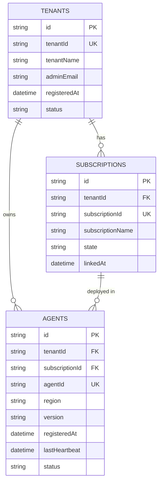

---

### 왜 이렇게 설계했는가?

#### 컬렉션을 3개로 나눈 이유

하나의 컬렉션에 모든 정보를 넣을 수도 있지만, **역할과 생명주기(Lifecycle)가 다르기 때문에** 3개로 분리했습니다.

| 컬렉션 | 핵심 질문 | 변경 빈도 |
| --- | --- | --- |
| `tenants` | "이 회사가 우리 서비스를 쓰는가?" | 거의 없음 (등록 1회) |
| `subscriptions` | "이 회사의 어떤 Azure 구독을 관리하는가?" | 가끔 (구독 추가/제거) |
| `agents` | "지금 Agent가 살아있는가? 최근에 언제 실행했는가?" | 자주 (heartbeat, 버전 업데이트) |

`agents`는 heartbeat 때문에 **30분마다 업데이트**됩니다. 만약 하나의 컬렉션에 모든 정보를 넣으면, 불필요하게 tenantName 같은 거의 바뀌지 않는 데이터까지 매번 덮어쓰게 되어 Cosmos DB RU(비용) 낭비가 발생합니다.

---

#### TENANTS 컬렉션

```json
{
  "id": "uuid",
  "tenantId": "a1b2c3d4-xxxx-xxxx-xxxx (SSO 토큰의 tid)",
  "tenantName": "Contoso Inc.",
  "adminEmail": "admin@contoso.com",
  "registeredAt": "2025-02-24T...",
  "status": "active"
}
```

> **tenantId를 왜 따로 저장하는가?**
> SSO 토큰의 `tid` 클레임이 곧 Azure AD Tenant ID입니다. 이 값이 "고객사를 구별하는 유일한 키"입니다. `id`(Cosmos 내부 PK)와 `tenantId`(Azure AD 키)를 분리한 이유는, Cosmos DB는 `id`를 파티션 키로 사용하지만 우리 비즈니스 로직은 항상 `tenantId`로 조회하기 때문입니다. 두 역할을 분리해야 인덱스 설계가 명확해집니다.

> **status 필드가 필요한 이유?**
> 고객사가 구독을 해지하거나 서비스를 중단할 때, 실제 데이터를 삭제하면 감사 이력이 사라집니다. `status`를 `"suspended"` 또는 `"inactive"`로 바꾸는 **소프트 삭제(Soft Delete)** 방식을 쓰면 이력이 보존됩니다.

---

#### SUBSCRIPTIONS 컬렉션

```json
{
  "id": "uuid",
  "tenantId": "a1b2c3d4-xxxx (TENANTS와 연결)",
  "subscriptionId": "sub-yyyy-zzzz (Azure 구독 ID)",
  "subscriptionName": "Contoso-Production",
  "state": "linked",
  "linkedAt": "2025-02-24T..."
}
```

> **왜 TENANTS와 분리했는가?**
> 하나의 고객사(테넌트)가 **여러 개의 Azure 구독**을 가질 수 있습니다. 예를 들어 "개발 구독", "운영 구독", "DR 구독"이 별도로 존재할 수 있습니다. TENANTS 안에 구독 목록을 배열로 넣으면 구독이 추가/삭제될 때마다 테넌트 문서 전체를 업데이트해야 하고, 쿼리도 복잡해집니다. 분리하면 구독 하나만 조회/수정이 가능합니다.

> **subscriptionId를 왜 저장하는가?**
> 이 값이 OBO 토큰으로 ARM API를 호출할 때 사용하는 Azure 구독 식별자입니다. Agent가 `should_i_run` 폴링 시 Provider에게 "나는 이 구독에 속한 Agent다"를 알릴 때도 이 ID를 사용합니다.

---

#### AGENTS 컬렉션

```json
{
  "id": "uuid",
  "tenantId": "a1b2c3d4-xxxx",
  "subscriptionId": "sub-yyyy-zzzz",
  "agentId": "agent-고유-식별자 (Functions App 이름 등)",
  "region": "koreacentral",
  "version": "1.2.0",
  "registeredAt": "2025-02-24T...",
  "lastHeartbeat": "2025-02-24T14:30:00Z",
  "status": "healthy"
}
```

> **lastHeartbeat가 핵심인 이유?**
> Agent가 살아있는지 죽었는지 확인하는 유일한 방법입니다. Agent는 `should_i_run` 폴링을 할 때마다 이 값을 업데이트합니다. Provider가 "30분 이상 heartbeat가 없다"는 것을 감지하면 Teams에 알림을 보낼 수 있습니다. 이 필드 없이는 Agent가 고장나도 아무도 모릅니다.

> **tenantId + subscriptionId를 둘 다 저장하는 이유?**
> Agent는 특정 구독 안에 배포되어 있지만, 정책을 조회할 때는 테넌트 전체 정책도 필요할 수 있습니다. `tenantId`로 "이 테넌트의 공통 정책"을, `subscriptionId`로 "이 구독 전용 정책"을 구분하여 조회할 수 있습니다. 두 ID를 모두 저장해 두면 쿼리 한 번으로 필요한 범위를 자유롭게 결정할 수 있습니다.

> **version 필드가 필요한 이유?**
> Agent는 고객사 환경에 배포된 코드이기 때문에, Provider와 버전이 맞지 않으면 API 호환성 문제가 생길 수 있습니다. Provider는 `version`을 보고 "이 Agent는 구버전이니 업데이트가 필요하다"는 메시지를 handshake 응답에 포함시킬 수 있습니다.

---

#### 전체 설계 원칙 요약

| 원칙 | 적용 내용 |
| --- | --- |
| **멀티테넌트 격리** | 모든 컬렉션에 `tenantId`를 포함 — 고객사 간 데이터가 절대 섞이지 않음 |
| **생명주기 분리** | 변경 빈도가 다른 데이터를 다른 컬렉션에 저장 — Cosmos RU 최소화 |
| **소프트 삭제** | `status` 필드로 삭제 처리 — 감사/이력 보존 |
| **Cosmos 파티션 전략** | `tenantId`를 파티션 키로 설정하면 같은 테넌트의 데이터가 같은 물리 파티션에 모임 — 조회 성능 최적화 |

---

## 9. Teams Frontend 화면 흐름

사용자가 Teams 앱에서 보는 화면 전환 순서입니다.

```mermaid
stateDiagram-v2
    [*] --> Login: Teams 앱 실행

    Login --> TenantRegistration: SSO 로그인 성공
    TenantRegistration --> NoPermission: 신규 테넌트 등록

    NoPermission --> SubscriptionLink: 구독 연동 시작
    SubscriptionLink --> SubscriptionSelect: OBO로 구독 목록 조회

    SubscriptionSelect --> AgentDeployGuide: 구독 선택 완료
    AgentDeployGuide --> WaitingHandshake: Bicep 템플릿 배포 안내

    WaitingHandshake --> Dashboard: Agent handshake 성공
    Dashboard --> ResourceView: 리소스 목록 조회

    state Dashboard {
        direction LR
        Overview: 전체 현황
        Retain: 보존 관리
        Prevent: 예방 규칙
        Detect: 위협 탐지
        Filter: 필터 설정
        Suggestions: LLM 제안
        History: 변경 이력
    }
```

---

## 10. 전체 번호 흐름 요약 (화이트보드 원본 기준)

화이트보드에 적힌 번호 순서대로의 전체 흐름입니다.

```mermaid
graph TD
    S1["① Front → Client Entra ID: SSO 토큰 요청"] --> S2["② Client Entra ID → Front: SSO 토큰 반환"]
    S2 --> S3["③ Front → Provider: POST /tenant + SSO 토큰"]
    S3 --> S4["④ Provider → Front: tenantId 검증 + 등록 응답"]
    S4 --> S5["⑤ Provider → Cosmos: tenant 저장"]
    S5 --> S6["⑥ Provider → Provider Entra ID: OBO 토큰 교환"]
    S6 --> S7["⑦ Provider Entra ID → Provider: OBO 토큰 반환"]
    S7 --> S8["⑧ Front → Provider: GET /subscriptions"]
    S8 --> S9["⑨ Provider → ARM: 구독 목록 조회 (OBO 토큰)"]
    S9 --> S10["⑩ Provider → Front: 구독 목록 응답"]
    S10 --> S11["⑪ Front → Provider: POST /subscriptions/select"]
    S11 --> S12["⑫ Provider → Cosmos: 선택 구독 저장"]
    S12 --> S13["⑬ 고객 Azure 템플릿 배포 (Bicep)"]
    S13 --> S14["⑭ Agent → Provider: handshake + 등록"]
    S14 --> S15["⑮ Provider → Agent: 정책 배포"]
    S15 --> S16["⑯ Agent → LAW: 로그 분석"]
    S16 --> S17["⑰ Agent → 고객 리소스: 리소스 분석"]

    style S1 fill:#4CAF50,color:#fff
    style S6 fill:#FF5722,color:#fff
    style S8 fill:#2196F3,color:#fff
    style S13 fill:#9C27B0,color:#fff
    style S14 fill:#9C27B0,color:#fff
    style S17 fill:#FF9800,color:#fff
```
